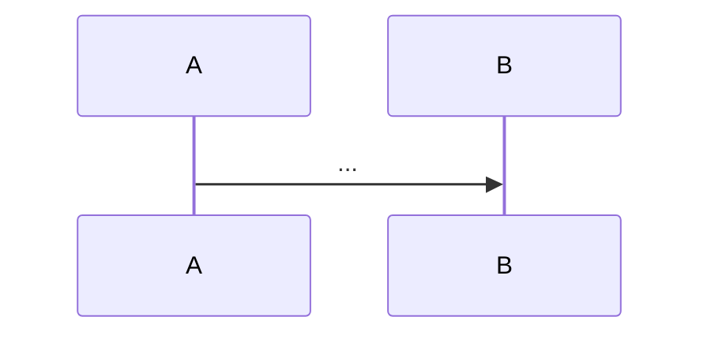

## Problem Summary

<!-- 1-2 sentences. -->

## Mermaid Diagram


```mermaid
sequenceDiagram
    participant A
    participant B
    A->>B: ...
```

## Concrete Example

```sql
-- code snippet or numerical breakdown
```

## Reference

- <!-- official docs link -->
