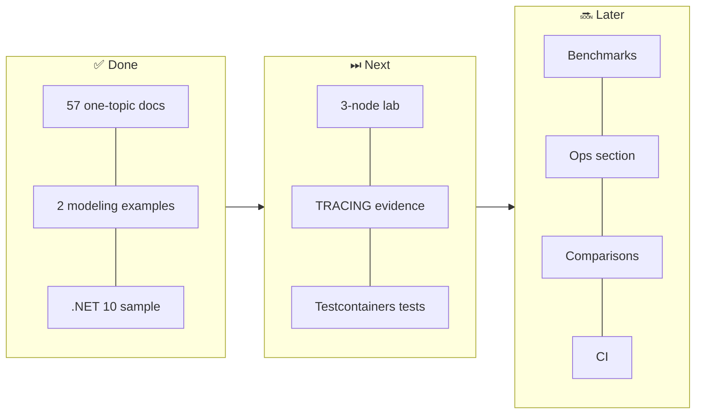

# Roadmap

[⬅ Back to README](README.md)

| # | Item | Output | Value |
|---:|---|---|---|
| 1 | **3-node cluster lab** (`docker-compose.cluster.yml`, 3 racks) | stop a node, show `QUORUM` ✅ vs `ALL` ❌, hints replay | architecture becomes observable |
| 2 | **`TRACING ON` evidence** per operation | real trace output in 04-read-write + 05-cost | replaces indicative numbers with measured ones |
| 3 | **Integration tests** (xUnit + Testcontainers.Cassandra) | one test per best practice / anti-pattern | proves every claim |
| 4 | **Benchmarks** (`cassandra-stress` / NoSQLBench) | ops/s + p99 table: insert vs select vs LWT vs batch | numeric cost ranking |
| 5 | **Operations section** | backup/snapshot, repair scheduling, `nodetool` cheat-sheet, Prometheus + Grafana | production readiness |
| 6 | **Comparison** | Cassandra vs ScyllaDB vs DynamoDB vs MongoDB vs PostgreSQL | decision table |
| 7 | **3rd modeling example** | audit / evidence log (append-only, retention, bucketing) | closer to real workloads |
| 8 | **Partition size calculator** | small script: rows/day × row size → bucket choice | practical design tool |
| 9 | **CI** (GitHub Actions) | `dotnet build`, markdownlint, mermaid render check, link check | keeps docs correct |
| 10 | **Glossary** | one table: term → one-line definition → file link | fast lookup |

---

[⬅ Back to README](README.md)
