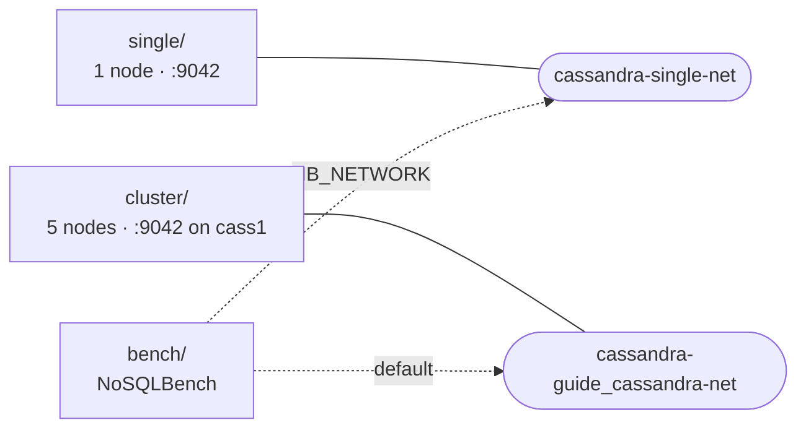

# Docker

[⬅ Back to README](../README.md)

One folder per stack: its compose file and every YAML it mounts sit together. Run all commands from the repo root.



```text
docker/
├── single/
│   └── compose.yml       # 1 node (container "cassandra"), mounts ../../cql
├── cluster/
│   └── compose.yml       # cass1…cass5, dc1, seeds cass1 + cass2
└── bench/
    ├── compose.yml       # NoSQLBench runner
    ├── shortly.yaml      # workload: scenarios slug · user · clicks
    └── results/          # CSV metrics (git-ignored)
```

| Stack | Start | Stop (keep data) | Guide |
|---|---|---|---|
| single | `docker compose -f docker/single/compose.yml up -d` | `… stop` | [README · Run It](../README.md#run-it) |
| cluster | `docker compose -f docker/cluster/compose.yml up -d` | `… stop` | [Lab 01](../docs/10-lab/01-five-node-cluster.md) |
| bench | `docker compose -f docker/bench/compose.yml run --rm nb` | — (exits by itself) | [Lab 03](../docs/10-lab/03-load-test.md) |

single and cluster both publish `9042` → run one at a time.

| Project (`name:`) | Network | Volumes |
|---|---|---|
| `cassandra-single` | `cassandra-single-net` | `cassandra-guide_cassandra-data` |
| `cassandra-guide` (cluster) | `cassandra-guide_cassandra-net` | `cassandra-guide_cass1-data` … `cass5-data` |
| `cassandra-bench` | joins one of the above | — |

Volume and project names are the ones used before the files moved here, so existing data and running containers are reused.

---

[⬅ Back to README](../README.md)
