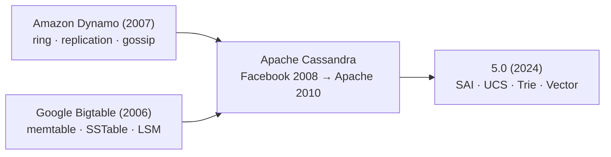

# What is Cassandra?

[⬅ Back to README](../../README.md)

## Problem Summary

A distributed, masterless **wide-column NoSQL** database built for **write-heavy** workloads across multiple datacenters with no single point of failure.

## Mermaid Diagram



## Concrete Example

| Property | Value |
|---|---|
| CAP | **AP** — consistency is tunable per query |
| Topology | Peer-to-peer; any node can act as coordinator |
| Scaling | Linear: 2× nodes → ~2× throughput |
| Storage | LSM-tree: commitlog → memtable → SSTable |
| Query language | CQL (SQL-like, no joins) |
| Port | `9042` (CQL native protocol) |

```sql
CREATE KEYSPACE shop
  WITH replication = {'class': 'NetworkTopologyStrategy', 'dc1': 3};
```

## Reference

- [Architecture Overview](https://cassandra.apache.org/doc/latest/cassandra/architecture/overview.html)

---

[⬅ Back to README](../../README.md)
