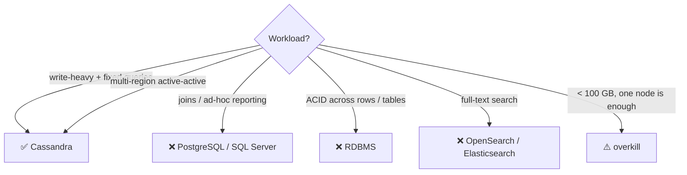

# When to Use It (and When Not To)

[⬅ Back to README](../../README.md)

## Problem Summary

Cassandra wins when queries are **known up front** and writes dominate. It loses on ad-hoc queries, joins and multi-row transactions.

## Mermaid Diagram

## Concrete Example

| Use case | Volume | Why it fits |
|---|---:|---|
| IoT: 1M devices × 1 reading/min | ≈ 16,700 writes/s | append-only + TTL |
| Chat: 50M messages/day | ≈ 580 writes/s (×10 peak) | "last 50 messages of conversation X" |
| Audit log | 1B events/month | insert-only, time-ordered |
| Shopping cart, 3 regions | multi-DC | `LOCAL_QUORUM` per region |

| ❌ Bad fit | Why |
|---|---|
| "All orders with total > 100 last month" | full scan of every node |
| Transfer balance between two accounts | no multi-partition transactions |

## Reference

- [Data Modeling vs RDBMS](https://cassandra.apache.org/doc/latest/cassandra/developing/data-modeling/data-modeling_rdbms.html)

---

[⬅ Back to README](../../README.md)
