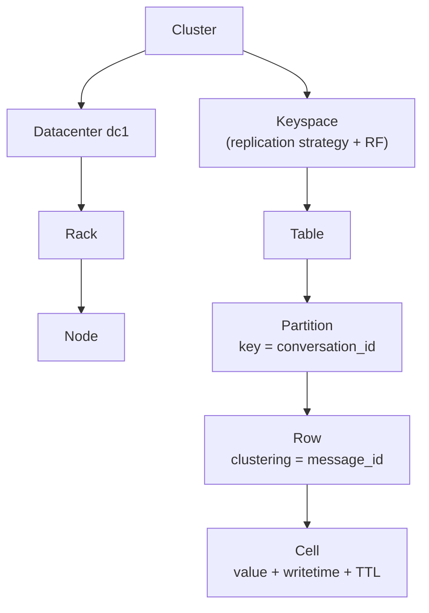

# Data Hierarchy

[⬅ Back to README](../../README.md)

## Problem Summary

Cluster → Keyspace → Table → **Partition** → Row → Cell. The partition is the unit of distribution and storage; it has no RDBMS equivalent.

## Mermaid Diagram



## Concrete Example

| Level | RDBMS | Example |
|---|---|---|
| Keyspace | Database | `chat` |
| Table | Table | `messages_by_conversation` |
| Partition | — | all messages of conversation `c-42` |
| Row | Row | one message |
| Cell | Column value | `body = 'hi'` |

```sql
SELECT body, WRITETIME(body), TTL(body)
FROM chat.messages_by_conversation
WHERE conversation_id = ? AND bucket = ? LIMIT 1;
-- body | writetime(body)   | ttl(body)
-- hi   | 1790418900000000  | null
```

## Reference

- [CQL Definitions](https://cassandra.apache.org/doc/latest/cassandra/developing/cql/definitions.html)

---

[⬅ Back to README](../../README.md)
