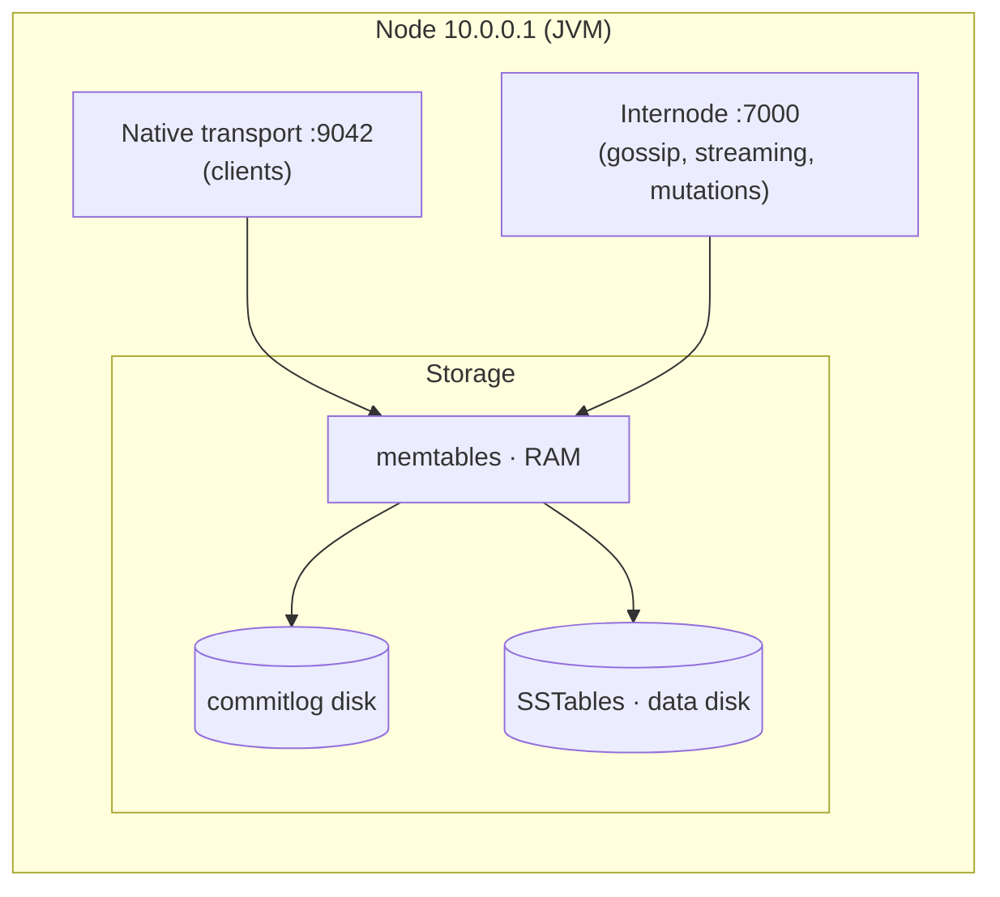

# Node

[⬅ Back to README](../../README.md)

## Problem Summary

One Cassandra process (JVM) on one machine. Every node is **equal**: stores data for its token ranges, serves reads/writes, and can coordinate any request. No master, no primary.

## Mermaid Diagram



## Concrete Example

| Resource | Typical production node |
|---|---|
| CPU | 16–32 cores |
| RAM | 64–128 GB (heap 16–31 GB, rest = OS page cache) |
| Disk | NVMe SSD, commitlog on separate disk if possible |
| Data per node | 1–4 TB (larger → slower repair/streaming) |
| Ports | 9042 CQL · 7000 internode · 7199 JMX |

```bash
nodetool info
# ID           : 5c0e...
# Gossip active: true
# Load         : 412.3 GiB
# Data Center  : dc1
# Rack         : r1
# Heap Memory  : 7.9 GiB / 16.0 GiB
```

## Reference

- [Architecture Overview](https://cassandra.apache.org/doc/latest/cassandra/architecture/overview.html)

---

[⬅ Back to README](../../README.md)
