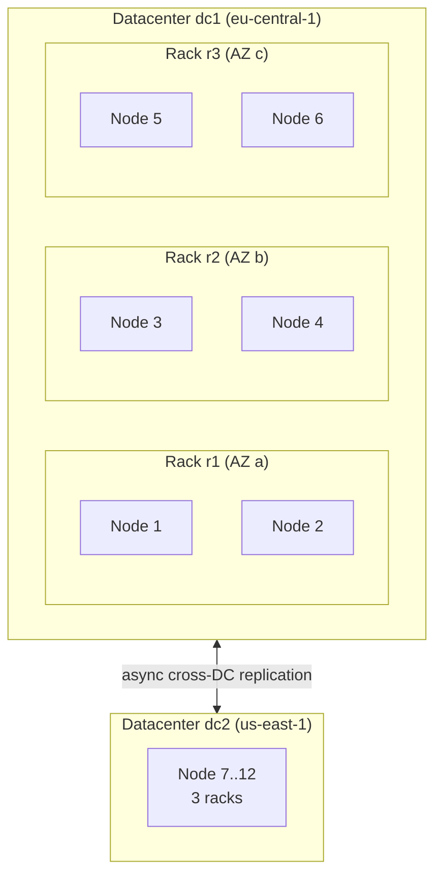

# Rack & Datacenter

[⬅ Back to README](../../README.md)

## Problem Summary

**Rack** = group of nodes that can fail together (same power/switch, or same cloud AZ). **Datacenter (DC)** = group of racks, usually one region, with its own replica set. Cassandra spreads replicas across racks and replicates across DCs.

## Mermaid Diagram



## Concrete Example

```properties
# cassandra-rackdc.properties on Node 3
dc=dc1
rack=r2
```

| Failure | RF=3 across 3 racks, `LOCAL_QUORUM` |
|---|---|
| 1 node down | ✅ 2 of 3 replicas left |
| whole rack / AZ down | ✅ each partition still has 2 replicas |
| whole DC down | ✅ clients fail over to dc2 |

| Common DC use | Example |
|---|---|
| Geo-locality | EU users → dc1, US users → dc2 |
| Workload isolation | `dc_analytics` for Spark jobs, `dc1` for OLTP |

## Reference

- [Snitch](https://cassandra.apache.org/doc/latest/cassandra/managing/operating/snitch.html)
- [Dynamo: Replication](https://cassandra.apache.org/doc/latest/cassandra/architecture/dynamo.html)

---

[⬅ Back to README](../../README.md)
