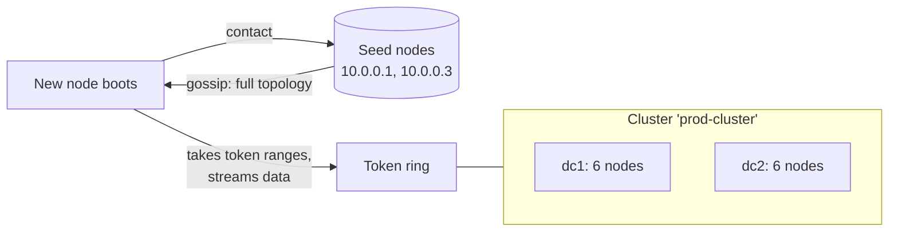

# Cluster

[⬅ Back to README](../../README.md)

## Problem Summary

The full set of nodes (across all DCs) that share one `cluster_name` and one token ring. Nodes discover each other through **seed nodes** + gossip.

## Mermaid Diagram



## Concrete Example

```yaml
# cassandra.yaml — identical on every node of the cluster
cluster_name: 'prod-cluster'
num_tokens: 16
seed_provider:
  - class_name: org.apache.cassandra.locator.SimpleSeedProvider
    parameters:
      - seeds: "10.0.0.1,10.0.0.3,10.0.1.1"   # 2–3 per DC, not all nodes
endpoint_snitch: GossipingPropertyFileSnitch
```

| Operation | Command |
|---|---|
| Cluster view | `nodetool status` |
| Add node | start it with same `cluster_name` + seeds → auto bootstrap |
| Remove live node | `nodetool decommission` |
| Remove dead node | `nodetool removenode <host-id>` |
| Rebalance cleanup | `nodetool cleanup` on old nodes after adding |

## Reference

- [Adding, replacing, moving and removing nodes](https://cassandra.apache.org/doc/latest/cassandra/managing/operating/topo_changes.html)

---

[⬅ Back to README](../../README.md)
