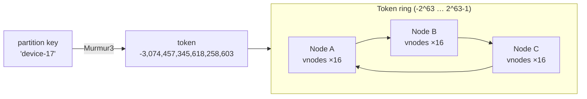

# Ring & Tokens

[⬅ Back to README](../../README.md)

## Problem Summary

Every partition key is hashed (Murmur3) into a 64-bit **token**. Each node owns token ranges on a ring; the token decides which node stores the partition.

## Mermaid Diagram



## Concrete Example

```sql
SELECT token(device_id), device_id FROM iot.latest_reading_by_device LIMIT 3;
--  system.token(device_id) | device_id
-- -8,120,111,904,211,552,881 | device-03
-- -3,074,457,345,618,258,603 | device-17
--  6,941,220,002,114,332,010 | device-08
```

| Setting | Default (4.0+) | Effect |
|---|---|---|
| `partitioner` | `Murmur3Partitioner` | uniform token spread |
| `num_tokens` | `16` | vnodes per node → smoother rebalancing |

Adding a 4th node to 3 nodes: it takes ~25% of the ranges, streamed from existing replicas; no manual resharding.

## Reference

- [Dynamo: Consistent Hashing](https://cassandra.apache.org/doc/latest/cassandra/architecture/dynamo.html)

---

[⬅ Back to README](../../README.md)
