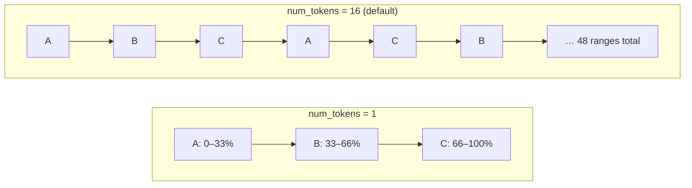

# Virtual Nodes (vnodes)

[⬅ Back to README](../../README.md)

## Problem Summary

Instead of one big token range per node, each node owns **many small ranges** (`num_tokens`). Adding/removing a node streams data from/to many peers in parallel and keeps load even.

## Mermaid Diagram

## Concrete Example

| Add a 4th node to 3 | `num_tokens: 1` | `num_tokens: 16` |
|---|---|---|
| Streams from | 1 neighbor | all 3 nodes in parallel |
| Load after | uneven (manual token math) | ≈ 25% each |
| Recovery of a failed node | 1 source → slow | many sources → fast |

| `num_tokens` | Note |
|---:|---|
| 256 | pre-4.0 default; hurts repair & availability |
| **16** | 4.0+ default; use with `allocate_tokens_for_local_replication_factor: 3` |
| 1 | only with manual token assignment |

## Reference

- [Dynamo: Virtual nodes](https://cassandra.apache.org/doc/latest/cassandra/architecture/dynamo.html)

---

[⬅ Back to README](../../README.md)
