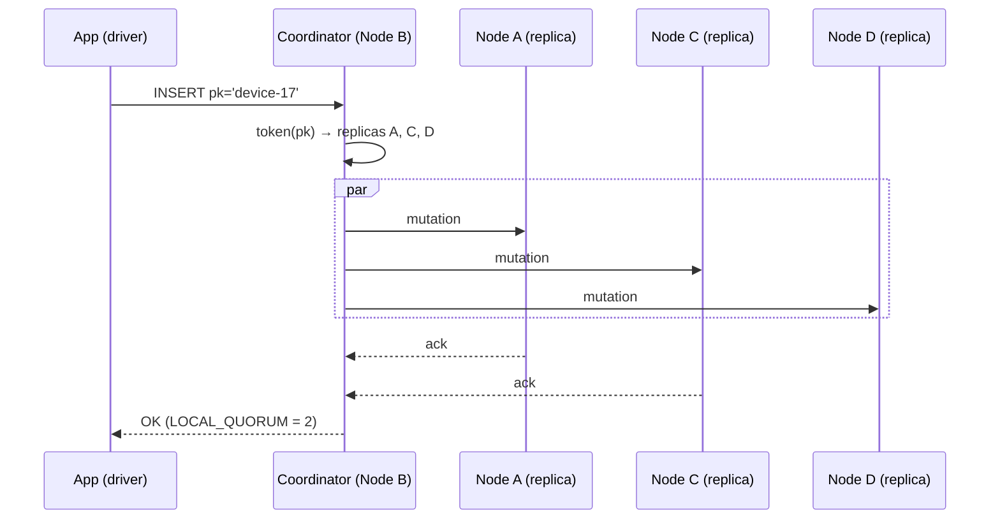

# Coordinator

[⬅ Back to README](../../README.md)

## Problem Summary

The node that receives a client request. It computes the token, finds the replicas, forwards the request, waits for CL acks, and replies. **Any node can coordinate**; a token-aware driver picks a replica as coordinator to save one network hop.

## Mermaid Diagram



## Concrete Example

| Driver policy | Coordinator | Network hops |
|---|---|---:|
| Round-robin | random node (maybe not a replica) | 2 |
| **Token-aware + DC-aware** | a local replica | 1 |

```csharp
Cluster.Builder()
    .AddContactPoint("10.0.0.1")
    .WithLoadBalancingPolicy(new DefaultLoadBalancingPolicy("dc1")) // token-aware + DC-aware
    .Build();
```

## Reference

- [Dynamo: Tunable Consistency](https://cassandra.apache.org/doc/latest/cassandra/architecture/dynamo.html)
- [C# driver: Tuning policies](https://docs.datastax.com/en/developer/csharp-driver/latest/features/tuning-policies/index.html)

---

[⬅ Back to README](../../README.md)
