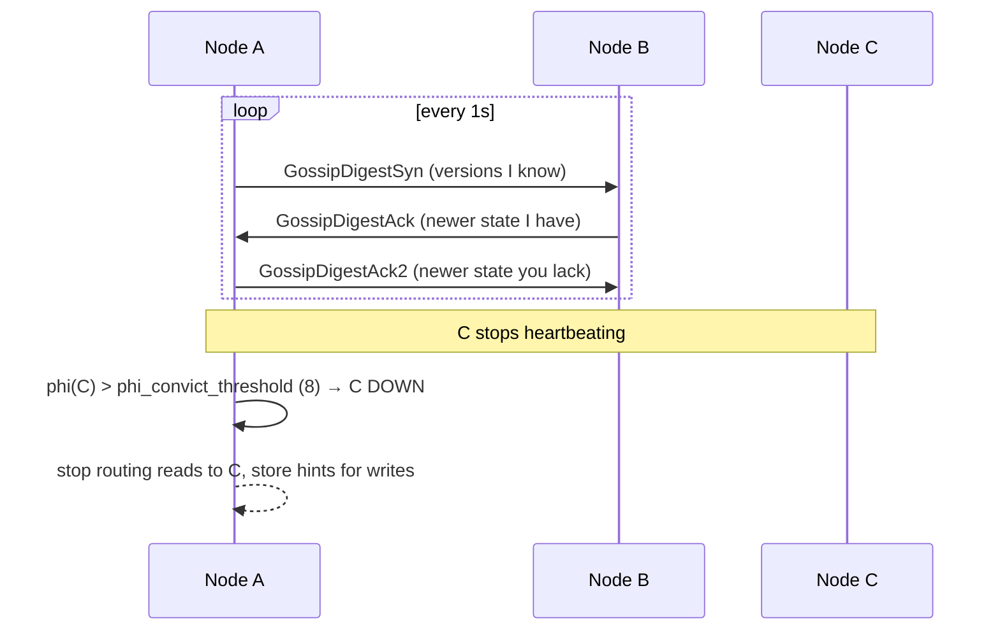

# Gossip & Failure Detection

[⬅ Back to README](../../README.md)

## Problem Summary

No master: nodes learn cluster state via **gossip** (every second, with up to 3 peers). A **Phi Accrual** failure detector marks nodes DOWN based on heartbeat delay statistics, not a fixed timeout.

## Mermaid Diagram



## Concrete Example

```bash
nodetool status
# Datacenter: dc1
# --  Address     Load      Tokens  Owns   Rack
# UN  10.0.0.1    412 GiB   16      33.4%  r1
# UN  10.0.0.2    398 GiB   16      33.1%  r2
# DN  10.0.0.3    405 GiB   16      33.5%  r3    ← Down/Normal
```

| Code | Meaning |
|---|---|
| `U` / `D` | Up / Down |
| `N` / `J` / `L` / `M` | Normal / Joining / Leaving / Moving |

## Reference

- [Dynamo: Gossip & Failure Detection](https://cassandra.apache.org/doc/latest/cassandra/architecture/dynamo.html)

---

[⬅ Back to README](../../README.md)
