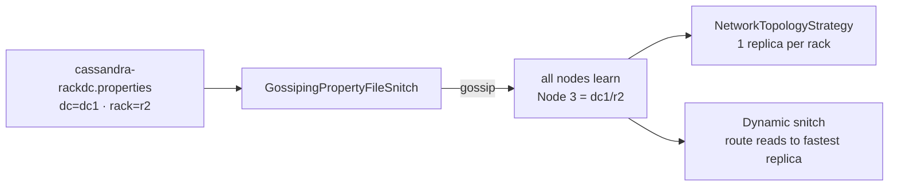

# Snitch

[⬅ Back to README](../../README.md)

## Problem Summary

Tells each node **which DC and rack** every node belongs to. Replication uses it to place replicas on different racks; routing uses it to prefer close nodes.

## Mermaid Diagram

## Concrete Example

| Snitch | Where DC/rack comes from | Use |
|---|---|---|
| **GossipingPropertyFileSnitch** | local `cassandra-rackdc.properties` | ✅ production default |
| Ec2Snitch / Ec2MultiRegionSnitch | AWS region / AZ | AWS |
| GoogleCloudSnitch | GCP region / zone | GCP |
| SimpleSnitch | nothing (one DC, one rack) | dev only |

⚠️ Changing a node's DC/rack after it holds data = replica placement breaks → requires decommission + re-add.

## Reference

- [Snitch](https://cassandra.apache.org/doc/latest/cassandra/managing/operating/snitch.html)

---

[⬅ Back to README](../../README.md)
