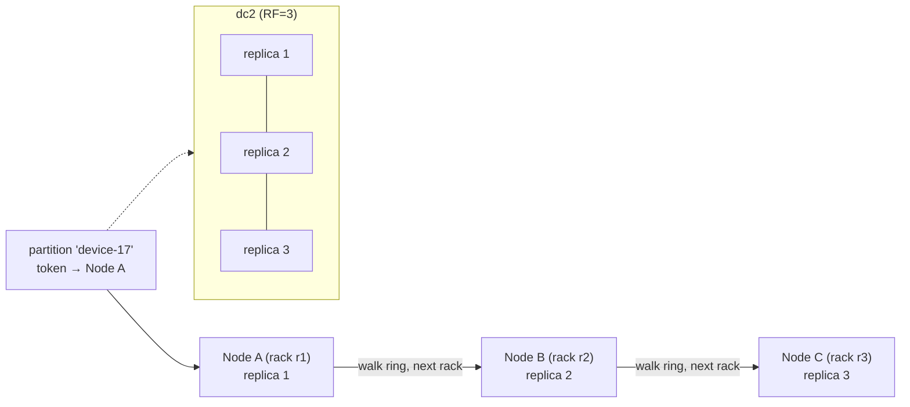

# Replication

[⬅ Back to README](../../README.md)

## Problem Summary

Each partition is copied to **RF** nodes. `NetworkTopologyStrategy` places replicas per datacenter and spreads them across racks (reported by the **snitch**).

## Mermaid Diagram



## Concrete Example

```sql
CREATE KEYSPACE iot WITH replication = {
  'class': 'NetworkTopologyStrategy',
  'dc1': 3,
  'dc2': 3
};
```

```properties
# cassandra-rackdc.properties  (GossipingPropertyFileSnitch)
dc=dc1
rack=r1
```

| RF | Nodes that can fail (QUORUM still works) | Disk cost |
|---:|---:|---:|
| 1 | 0 | 1× |
| 3 | 1 | 3× |
| 5 | 2 | 5× |

❌ `SimpleStrategy` in production: ignores racks and DCs.

## Reference

- [Dynamo: Replication](https://cassandra.apache.org/doc/latest/cassandra/architecture/dynamo.html)
- [Snitch](https://cassandra.apache.org/doc/latest/cassandra/managing/operating/snitch.html)

---

[⬅ Back to README](../../README.md)
