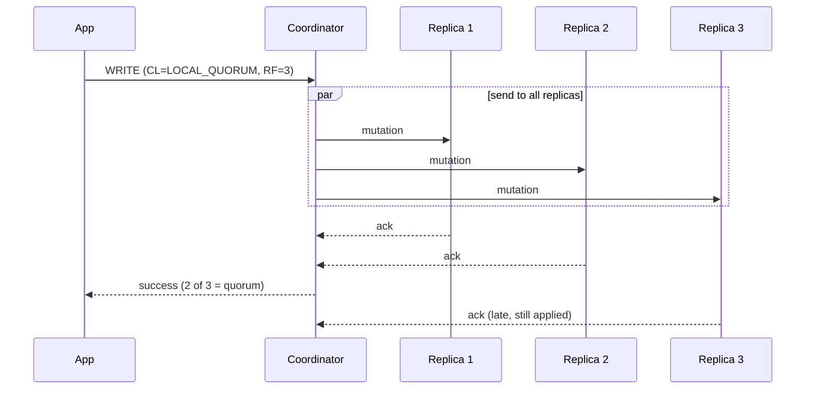

# Consistency Levels

[⬅ Back to README](../../README.md)

## Problem Summary

Consistency Level (CL) = how many replicas must answer before the coordinator replies. **Strong consistency when `R + W > RF`.**

## Mermaid Diagram

## Concrete Example

`QUORUM = floor(RF / 2) + 1`

| RF | Write CL | Read CL | R + W | Strong? | Tolerates down |
|---:|---|---|---:|:---:|---:|
| 3 | ONE | ONE | 2 | ❌ | 2 |
| 3 | QUORUM (2) | QUORUM (2) | 4 | ✅ | 1 |
| 3 | ALL (3) | ONE | 4 | ✅ | 0 for writes |
| 5 | QUORUM (3) | QUORUM (3) | 6 | ✅ | 2 |

| CL | Use |
|---|---|
| `LOCAL_QUORUM` | default choice for multi-DC apps |
| `LOCAL_ONE` | analytics / non-critical reads |
| `EACH_QUORUM` | writes that must hit quorum in every DC |
| `SERIAL` / `LOCAL_SERIAL` | lightweight transactions (Paxos) |

## Reference

- [Guarantees](https://cassandra.apache.org/doc/latest/cassandra/architecture/guarantees.html)
- [Dynamo: Tunable Consistency](https://cassandra.apache.org/doc/latest/cassandra/architecture/dynamo.html)

---

[⬅ Back to README](../../README.md)
