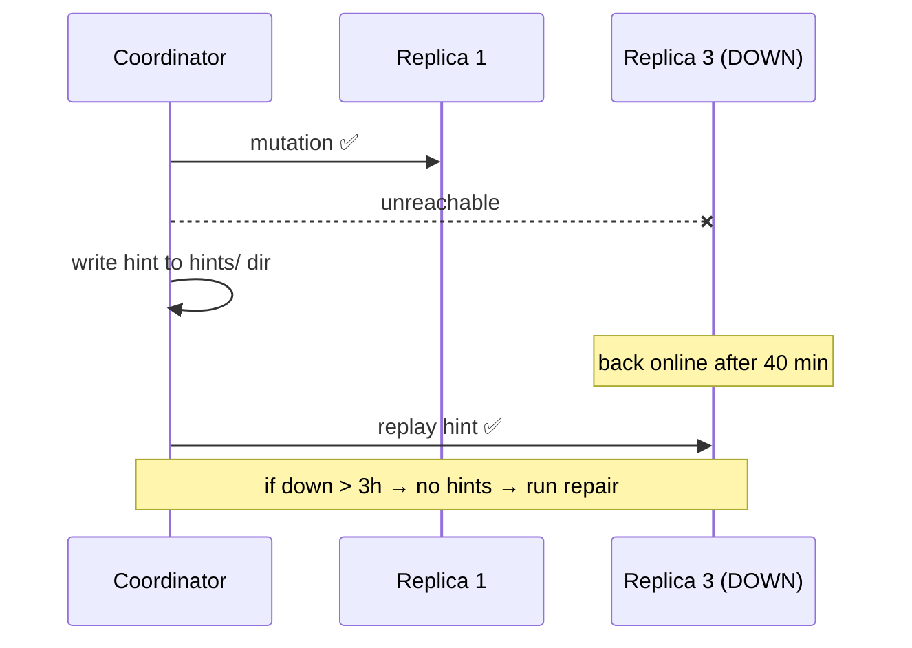

# Hinted Handoff

[⬅ Back to README](../../README.md)

## Problem Summary

When a replica is down, the coordinator stores the write as a **hint** and replays it when the replica returns — for up to `max_hint_window` (default **3h**).

## Mermaid Diagram



## Concrete Example

```yaml
# cassandra.yaml
hinted_handoff_enabled: true
max_hint_window: 3h
hinted_handoff_throttle: 1024KiB
```

| Downtime | Recovery |
|---|---|
| 10 min | hints replay automatically |
| 5 h | hints stop after 3h → `nodetool repair` required |

⚠️ A hint does **not** count toward CL (except `ANY`).

## Reference

- [Hints](https://cassandra.apache.org/doc/latest/cassandra/managing/operating/hints.html)

---

[⬅ Back to README](../../README.md)
