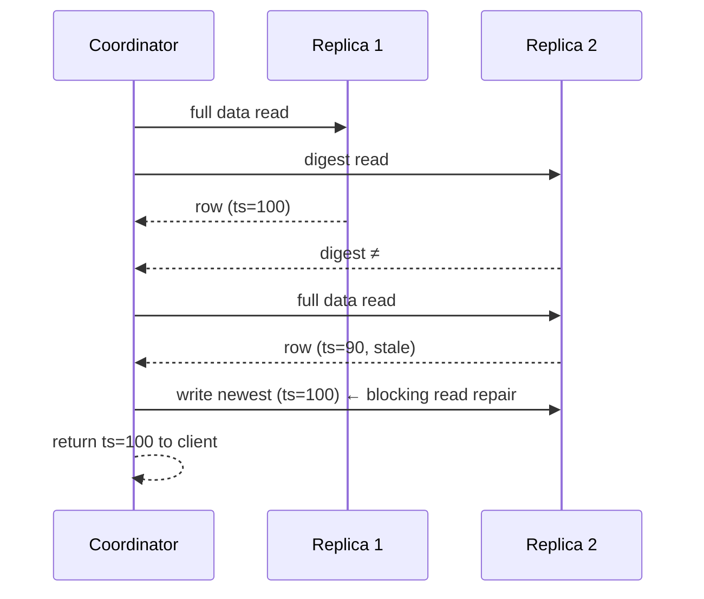

# Read Repair & Anti-Entropy Repair

[⬅ Back to README](../../README.md)

## Problem Summary

Replicas drift. **Read repair** fixes the rows a query touches; **anti-entropy repair** (`nodetool repair`) compares Merkle trees and fixes everything. Must run at least once every `gc_grace_seconds` (default **10 days**).

## Mermaid Diagram



## Concrete Example

```bash
# full repair of primary ranges only; run on every node in turn
nodetool repair --full -pr iot

# incremental repair (default since 4.0); repairs only unrepaired SSTables
nodetool repair iot
```

| Scenario | Result |
|---|---|
| Repair every 7 days, `gc_grace_seconds = 864000` (10d) | ✅ safe |
| No repair for 14 days + a delete | ❌ **zombie data**: tombstone purged, old value resurrects |

## Reference

- [Read Repair](https://cassandra.apache.org/doc/latest/cassandra/managing/operating/read_repair.html)
- [Repair](https://cassandra.apache.org/doc/latest/cassandra/managing/operating/repair.html)

---

[⬅ Back to README](../../README.md)
