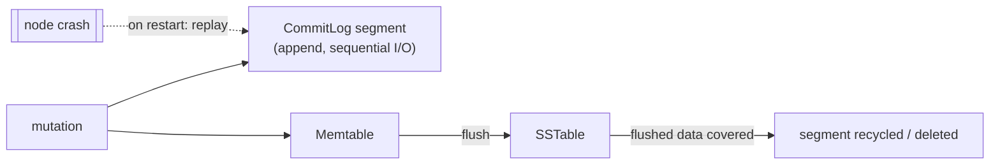

# Commit Log

[⬅ Back to README](../../README.md)

## Problem Summary

Append-only, sequential log on disk. Every write lands here first → durability if the node crashes before the memtable is flushed.

## Mermaid Diagram



## Concrete Example

```yaml
# cassandra.yaml
commitlog_sync: periodic          # fsync every period (default)
commitlog_sync_period: 10000ms    # up to 10s of acked writes at risk per node
commitlog_segment_size: 32MiB
commitlog_directory: /var/lib/cassandra/commitlog   # ideally a separate disk
```

| `commitlog_sync` | Latency | Risk |
|---|---|---|
| `periodic` (10s) | lowest | lose ≤10s on a single node; RF=3 covers it |
| `group` | medium | fsync batched in a window |
| `batch` | highest | ack only after fsync |

## Reference

- [Storage Engine: CommitLog](https://cassandra.apache.org/doc/latest/cassandra/architecture/storage-engine.html)

---

[⬅ Back to README](../../README.md)
