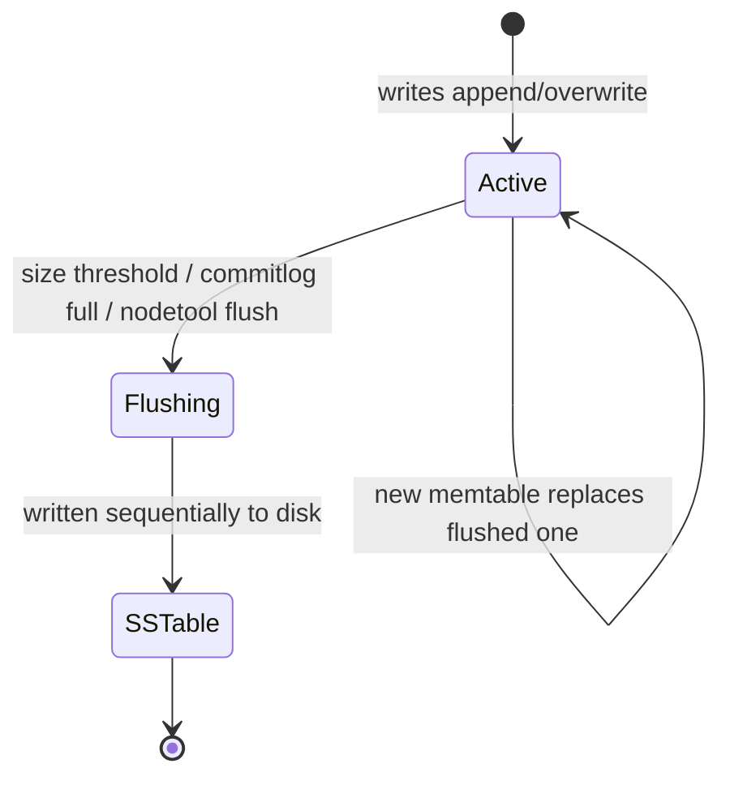

# Memtable

[⬅ Back to README](../../README.md)

## Problem Summary

In-memory, sorted structure per table. Writes are applied here after the commitlog; when full it is **flushed** to an immutable SSTable.

## Mermaid Diagram



## Concrete Example

```yaml
# cassandra.yaml (5.0)
memtable_heap_space: 2048MiB
memtable_offheap_space: 2048MiB
memtable_allocation_type: offheap_objects
memtable:
  configurations:
    default:
      class_name: TrieMemtable     # 5.0: less GC, faster lookups
```

```bash
nodetool flush iot readings_by_device_day   # force memtable → SSTable
```

| Memtable | Heap use | GC pressure |
|---|---|---|
| SkipListMemtable (legacy) | high | high |
| TrieMemtable (5.0) | lower | lower |

## Reference

- [Storage Engine: Memtables](https://cassandra.apache.org/doc/latest/cassandra/architecture/storage-engine.html)

---

[⬅ Back to README](../../README.md)
