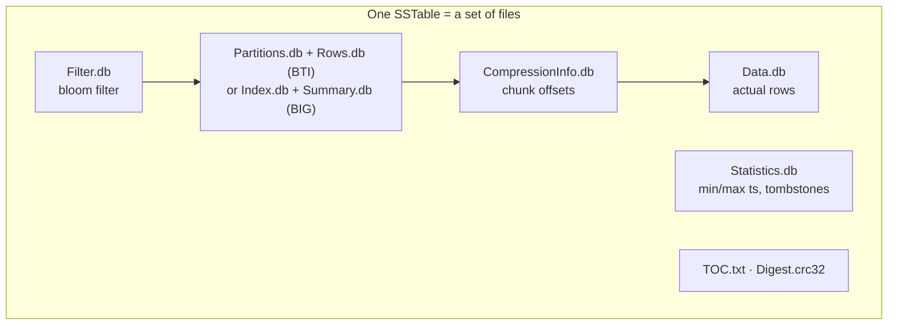

# SSTable

[⬅ Back to README](../../README.md)

## Problem Summary

**Sorted String Table**: immutable on-disk file set, sorted by token then clustering key. Never updated in place — updates/deletes create new SSTables, merged later by compaction.

## Mermaid Diagram



## Concrete Example

```bash
ls /var/lib/cassandra/data/iot/readings_by_device_day-*/
# da-1-bti-Data.db  da-1-bti-Filter.db  da-1-bti-Partitions.db  da-1-bti-Rows.db
# da-1-bti-CompressionInfo.db  da-1-bti-Statistics.db  da-1-bti-TOC.txt ...

nodetool tablestats iot.readings_by_device_day | grep -E "SSTable count|Space used"
#   SSTable count: 7
#   Space used (live): 18.4 GiB
```

| Format | Version | Index |
|---|---|---|
| BIG | ≤ 4.x (default) | Index.db + Summary.db |
| BTI (Trie) | 5.0 (optional) | Partitions.db + Rows.db — smaller, faster |

## Reference

- [Storage Engine: SSTables](https://cassandra.apache.org/doc/latest/cassandra/architecture/storage-engine.html)

---

[⬅ Back to README](../../README.md)
