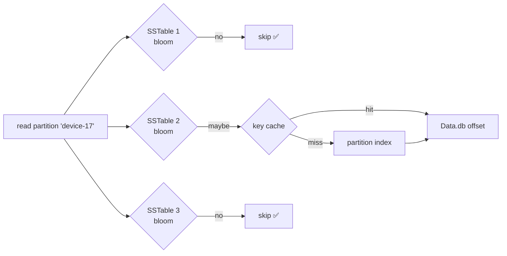

# Bloom Filter & Caches

[⬅ Back to README](../../README.md)

## Problem Summary

A read may touch many SSTables. The **bloom filter** answers "definitely not here" in memory, so most SSTables are skipped without disk I/O. **Key cache** skips the partition index lookup.

## Mermaid Diagram



## Concrete Example

```sql
ALTER TABLE iot.readings_by_device_day
  WITH bloom_filter_fp_chance = 0.01;   -- 1% false positives (default for STCS/UCS)
```

| `bloom_filter_fp_chance` | Memory per 1B partitions (approx) | Wasted disk reads |
|---:|---:|---:|
| 0.1 | ~0.6 GB | 10% |
| 0.01 | ~1.2 GB | 1% |
| 0.001 | ~1.8 GB | 0.1% |

```bash
nodetool tablestats iot.readings_by_device_day | grep -i bloom
#   Bloom filter false ratio: 0.00812
#   Bloom filter space used: 1.1 GiB
```

## Reference

- [Bloom Filters](https://cassandra.apache.org/doc/latest/cassandra/managing/operating/bloom_filters.html)

---

[⬅ Back to README](../../README.md)
