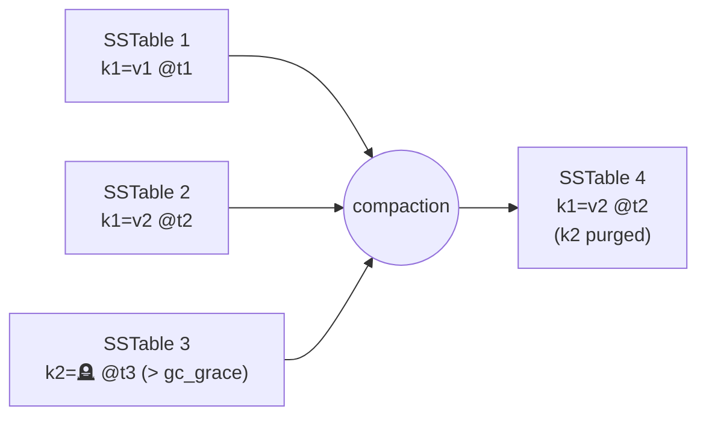

# Compaction

[⬅ Back to README](../../README.md)

## Problem Summary

Merges SSTables: keeps the newest cell per key (last-write-wins by timestamp), drops expired TTLs and purgeable tombstones. Fewer SSTables = fewer disk reads per query.

## Mermaid Diagram



## Concrete Example

| Strategy | Best for | Write amp | Read amp |
|---|---|---|---|
| **UCS** (5.0) | general default; tunable | configurable | configurable |
| STCS | write-heavy | low | high |
| LCS | read-heavy, updates | high | low (≤ ~1 SSTable/read at L1+) |
| **TWCS** | time-series + TTL | low | low for recent data |

```sql
-- time-series with 30-day TTL: 1-day windows → whole SSTables expire and drop
ALTER TABLE iot.readings_by_device_day WITH compaction = {
  'class': 'TimeWindowCompactionStrategy',
  'compaction_window_unit': 'DAYS',
  'compaction_window_size': 1
} AND default_time_to_live = 2592000;

-- 5.0 unified strategy
ALTER TABLE chat.messages_by_conversation WITH compaction = {
  'class': 'UnifiedCompactionStrategy',
  'scaling_parameters': 'T4'
};
```

## Reference

- [Compaction](https://cassandra.apache.org/doc/latest/cassandra/managing/operating/compaction/index.html)
- [UCS](https://cassandra.apache.org/doc/latest/cassandra/managing/operating/compaction/ucs.html) · [TWCS](https://cassandra.apache.org/doc/latest/cassandra/managing/operating/compaction/twcs.html)

---

[⬅ Back to README](../../README.md)
