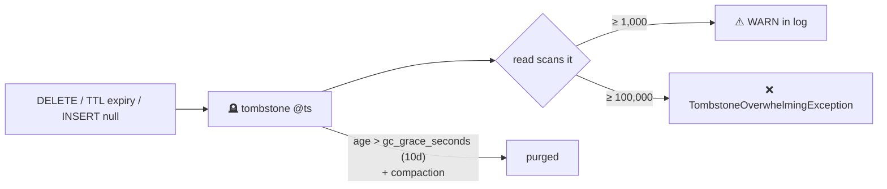

# Tombstones

[⬅ Back to README](../../README.md)

## Problem Summary

SSTables are immutable, so a delete **writes a marker** (tombstone). It shadows older data until compaction purges it after `gc_grace_seconds`. Too many tombstones in one read → slow or failed queries.

## Mermaid Diagram



## Concrete Example

| Source | Tombstone type |
|---|---|
| `DELETE FROM t WHERE pk=? AND ck=?` | row |
| `DELETE FROM t WHERE pk=?` | partition (cheap: one marker) |
| `DELETE FROM t WHERE pk=? AND ck > ?` | range |
| `INSERT ... (col) VALUES (null)` | cell ❗ |
| TTL expired | cell |

```yaml
# cassandra.yaml
tombstone_warn_threshold: 1000
tombstone_failure_threshold: 100000
```

```sql
-- per table
ALTER TABLE iot.readings_by_device_day WITH gc_grace_seconds = 864000;  -- 10 days
```

## Reference

- [Storage Engine](https://cassandra.apache.org/doc/latest/cassandra/architecture/storage-engine.html)
- [Compaction: Tombstones](https://cassandra.apache.org/doc/latest/cassandra/managing/operating/compaction/index.html)

---

[⬅ Back to README](../../README.md)
