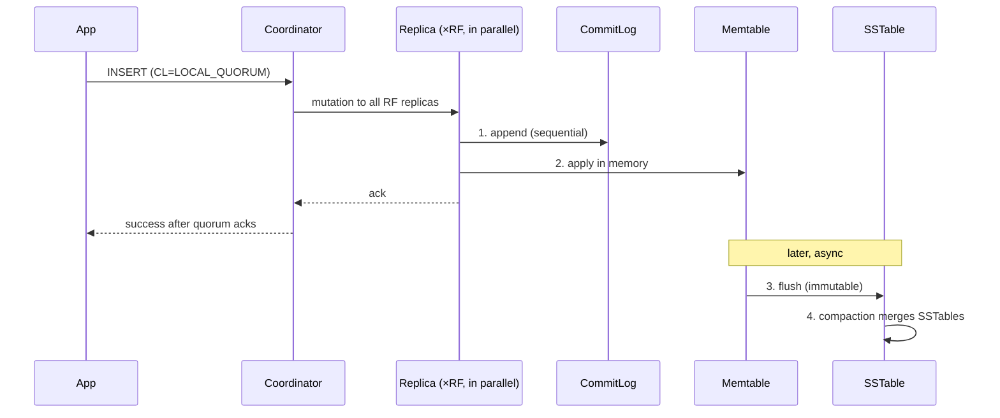

# Write Path

[⬅ Back to README](../../README.md)

## Problem Summary

A write is **append-only**: commitlog + memtable, then ack. No read, no disk seek, no lock → writes are the cheapest operation in Cassandra.

## Mermaid Diagram



## Concrete Example

```sql
INSERT INTO iot.readings_by_device_day (device_id, day, ts, temperature)
VALUES ('device-17', '2026-09-26', '2026-09-26 10:15:00', 21.4)
USING TTL 2592000;
```

| Step | I/O type | Typical cost |
|---|---|---|
| CommitLog append | sequential disk | µs (batched fsync) |
| Memtable insert | RAM | µs |
| Network to replicas | 1 round trip | ~0.5–2 ms in-DC |
| Flush / compaction | background | not on request path |

- `INSERT` and `UPDATE` are both **upserts** — no existence check.
- Conflicts resolved by **last-write-wins** on cell `writetime`.

## Reference

- [Storage Engine](https://cassandra.apache.org/doc/latest/cassandra/architecture/storage-engine.html)
- [Guarantees](https://cassandra.apache.org/doc/latest/cassandra/architecture/guarantees.html)

---

[⬅ Back to README](../../README.md)
