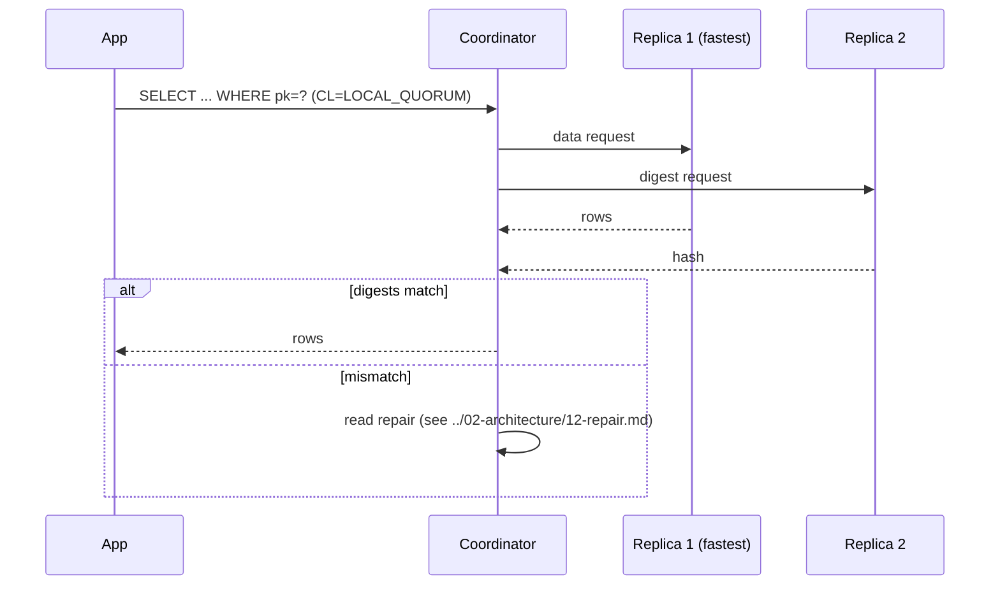
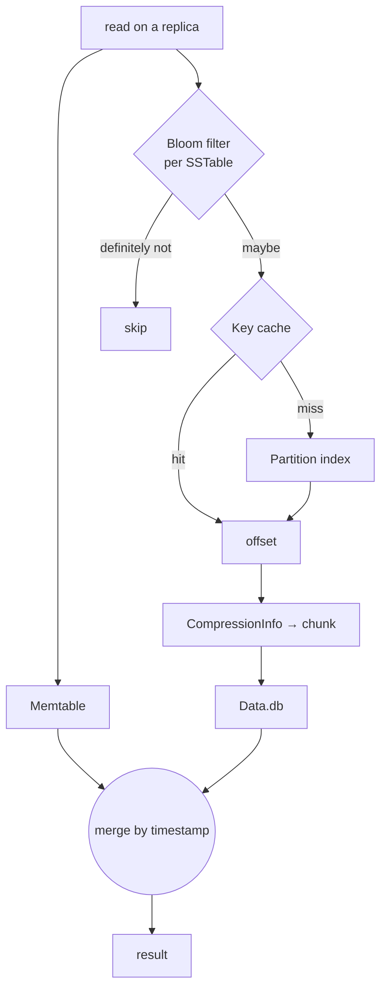

# Read Path

[⬅ Back to README](../../README.md)

## Problem Summary

A read must **merge** the memtable and every SSTable that may contain the partition, then pick the newest cell per column. Cost grows with SSTables touched and tombstones scanned.

## Mermaid Diagram





## Concrete Example

```sql
TRACING ON;
SELECT * FROM iot.readings_by_device_day
WHERE device_id = 'device-17' AND day = '2026-09-26' LIMIT 100;
-- sample trace (abridged):
-- Merged data from memtables and 2 sstables
-- Read 100 live rows and 0 tombstone cells
-- Request complete | 1,240 µs
```

| Factor | Good | Bad |
|---|---:|---:|
| SSTables per read | 1–3 | > 10 |
| Tombstones scanned | 0 | > 1,000 (warn) |
| Partition size | < 100 MB | GBs |

```bash
nodetool tablehistograms iot readings_by_device_day   # sample output
# Percentile  SSTables  Read Latency(µs)  Partition Size
# 50%         1.00      310               1.2 MB
# 99%         3.00      1,900             4.1 MB
```

## Reference

- [Storage Engine](https://cassandra.apache.org/doc/latest/cassandra/architecture/storage-engine.html)
- [nodetool tablehistograms](https://cassandra.apache.org/doc/latest/cassandra/managing/tools/nodetool/tablehistograms.html)

---

[⬅ Back to README](../../README.md)
