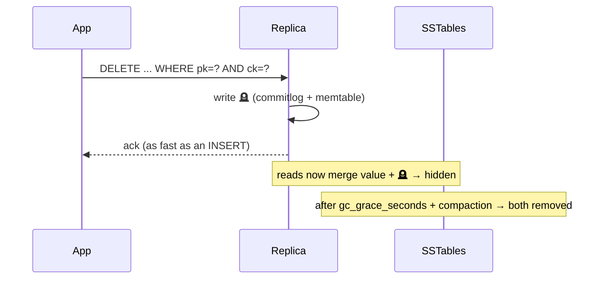

# Delete Path

[⬅ Back to README](../../README.md)

## Problem Summary

A delete is a **write** of a tombstone — cheap now, expensive later: every read of that range must scan it until compaction purges it after `gc_grace_seconds`.

## Mermaid Diagram



## Concrete Example

| Delete shape | Tombstones created | Read cost after |
|---|---:|---|
| `DELETE ... WHERE pk='c-42'` | 1 partition marker | ✅ low |
| `DELETE ... WHERE pk='c-42' AND ck < ?` | 1 range marker | ✅ low |
| 10,000 × `DELETE ... WHERE pk=? AND ck=?` | 10,000 | ❌ warn at 1,000 |
| `USING TTL 86400` + TWCS | whole SSTables dropped | ✅ best for time-series |

```sql
-- prefer one range tombstone over many row tombstones
DELETE FROM chat.messages_by_conversation
WHERE conversation_id = ? AND bucket = ? AND message_id < ?;
```

## Reference

- [CQL DML: DELETE](https://cassandra.apache.org/doc/latest/cassandra/developing/cql/dml.html)

---

[⬅ Back to README](../../README.md)
