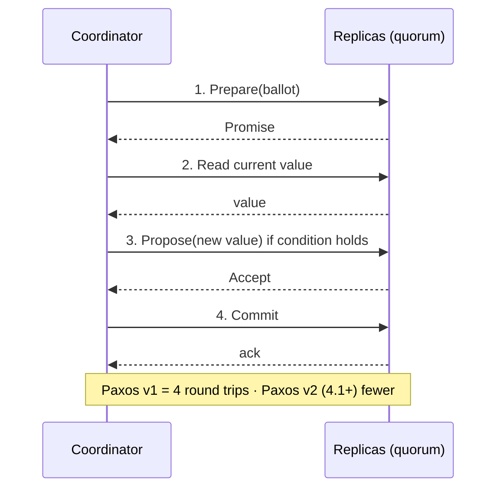

# Lightweight Transactions (LWT)

[⬅ Back to README](../../README.md)

## Problem Summary

`IF NOT EXISTS` / `IF col = ?` gives **compare-and-set** on one partition via Paxos. Linearizable, but needs extra round trips and a read → use only where uniqueness matters.

## Mermaid Diagram



## Concrete Example

```sql
INSERT INTO shop.users_by_email (email, user_id)
VALUES ('sara@example.com', 5b6962dd-3f90-4c93-8f61-eabfa4a803e2)
IF NOT EXISTS;
--  [applied] | email            | user_id
--  False     | sara@example.com | 1d2e...   ← already taken
```

| Operation | Round trips (in-DC) | Relative latency |
|---|---:|---:|
| `INSERT` | 1 | 1× |
| `INSERT ... IF NOT EXISTS` | up to 4 | ~4–5× |

```yaml
# cassandra.yaml (4.1+)
paxos_variant: v2
```

## Reference

- [CQL DML: Conditional statements](https://cassandra.apache.org/doc/latest/cassandra/developing/cql/dml.html)

---

[⬅ Back to README](../../README.md)
