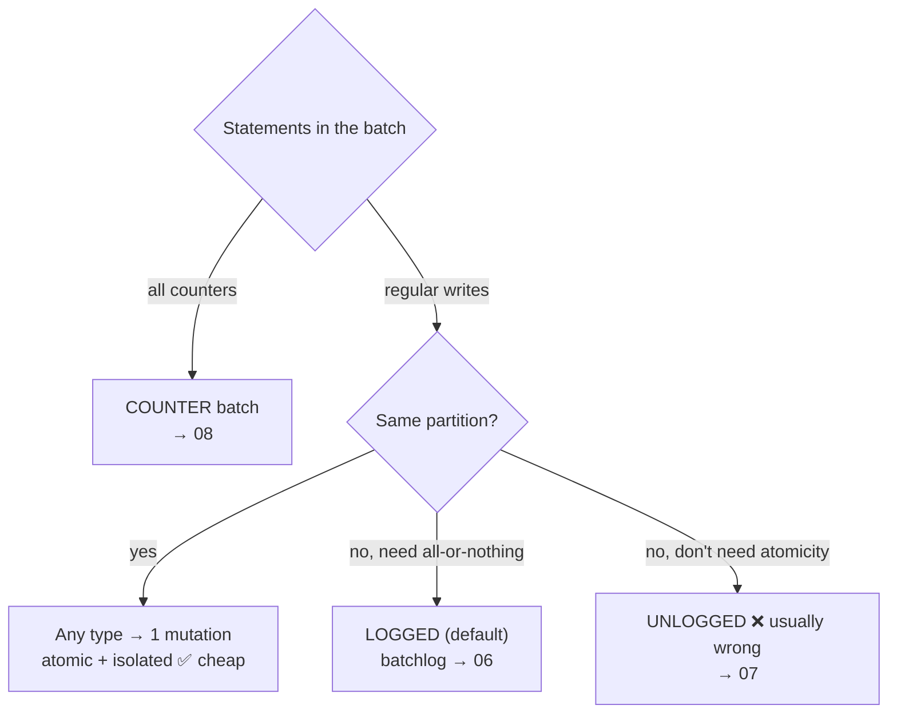

# Batches — Overview

[⬅ Back to README](../../README.md)

## Problem Summary

A batch groups writes for **atomicity**, not speed. Three types, and the real cost depends on one question: **one partition or many?**

## Mermaid Diagram



## Concrete Example

| Type | CQL | Batchlog | Atomic across partitions | Isolated | Relative cost (N partitions, RF=3) |
|---|---|:---:|:---:|:---:|---|
| LOGGED (default) | `BEGIN BATCH` | ✅ 2 nodes | ✅ eventually | ❌ | N×3 writes + 2 batchlog writes + 2 deletes |
| UNLOGGED | `BEGIN UNLOGGED BATCH` | ❌ | ❌ | ❌ | N×3 writes, 1 coordinator |
| COUNTER | `BEGIN COUNTER BATCH` | ❌ | ❌ | ❌ | counter only, not idempotent |
| Any type, **1 partition** | — | ❌ skipped | n/a | ✅ | 1 mutation × 3 replicas |

```csharp
var batch = new BatchStatement().SetBatchType(BatchType.Logged);   // Logged | Unlogged | Counter
```

| Threshold (`cassandra.yaml`) | Default |
|---|---:|
| `batch_size_warn_threshold` | 5 KiB |
| `batch_size_fail_threshold` | 50 KiB |
| `unlogged_batch_across_partitions_warn_threshold` | 10 partitions |

Details: [06 Logged](06-logged-batch.md) · [07 Unlogged](07-unlogged-batch.md) · [08 Counter](08-counter-batch.md) · bulk-load anti-pattern: [09-anti-patterns/05](../09-anti-patterns/05-multi-partition-batch.md)

## Reference

- [CQL DML: BATCH](https://cassandra.apache.org/doc/latest/cassandra/developing/cql/dml.html)

---

[⬅ Back to README](../../README.md)
