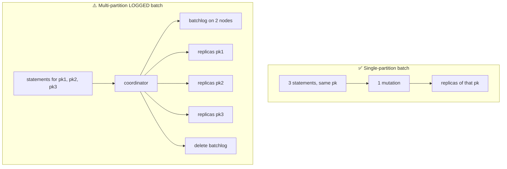

# Batches

[⬅ Back to README](../../README.md)

## Problem Summary

A batch is for **atomicity**, not performance. Single-partition batch = one mutation (cheap, atomic). Multi-partition **logged** batch = extra batchlog write on 2 other nodes + coordinator bottleneck.

## Mermaid Diagram



## Concrete Example

```sql
-- ✅ keep denormalized tables in sync: atomic across 2 tables, small
BEGIN BATCH
  INSERT INTO chat.messages_by_conversation (...) VALUES (...);
  UPDATE chat.conversations_by_user SET last_message_at = ? WHERE user_id = ? AND conversation_id = ?;
APPLY BATCH;
```

| Threshold (`cassandra.yaml`) | Default |
|---|---:|
| `batch_size_warn_threshold` | 5 KiB |
| `batch_size_fail_threshold` | 50 KiB |
| `unlogged_batch_across_partitions_warn_threshold` | 10 partitions |

❌ Bulk loading 10,000 rows in one batch → use concurrent async single inserts instead (see [09-anti-patterns/05](../09-anti-patterns/05-multi-partition-batch.md)).

## Reference

- [CQL DML: BATCH](https://cassandra.apache.org/doc/latest/cassandra/developing/cql/dml.html)

---

[⬅ Back to README](../../README.md)
