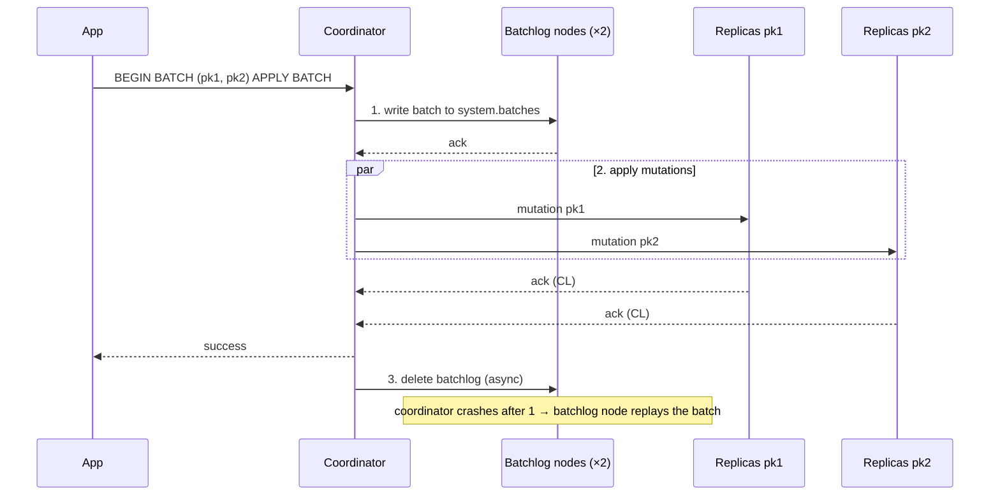

# Logged Batch (Batchlog)

[⬅ Back to README](../../README.md)

## Problem Summary

Default batch type. Before applying anything, the coordinator saves the whole batch to a **batchlog** on 2 other nodes. If the coordinator dies mid-way, those nodes **replay** it → all statements are eventually applied.

## Mermaid Diagram



## Concrete Example

```sql
-- keep 2 denormalized tables in sync (2 partitions)
BEGIN BATCH
  INSERT INTO shop.orders_by_customer (customer_id, order_id, total) VALUES (?, ?, 120.0);
  INSERT INTO shop.orders_by_id      (order_id, customer_id, total) VALUES (?, ?, 120.0);
APPLY BATCH;
```

```text
-- TRACING ON, Cassandra 5.0 (real output, abridged)
-- 2 partitions (pk=2, pk=3):
Determining replicas for atomic batch
Adding to batches memtable        ← batchlog write
Adding to batches memtable        ← batchlog delete
-- 1 partition (pk=1): no "atomic batch" lines → batchlog skipped
```

| Guarantee | Logged, multi-partition |
|---|---|
| Atomicity | ✅ all or (eventually) all |
| Isolation | ❌ a reader can see pk1 updated, pk2 not yet |
| Ordering | ❌ statements are not ordered |
| Latency | ≈ 2 sequential round trips (batchlog, then mutations) |

| `WriteTimeoutException.WriteType` (string) | Meaning | Action |
|---|---|---|
| `"BATCH_LOG"` | batchlog write timed out, nothing guaranteed | retry (statements idempotent) |
| `"BATCH"` | batchlog saved, mutations timed out | will be replayed; retry is safe but optional |

## Pitfall

All statements share **one timestamp** → on a tie, a tombstone wins.

```sql
BEGIN BATCH
  DELETE FROM t WHERE pk = 1;
  INSERT INTO t (pk, v) VALUES (1, 'new');   -- ❌ lost: same timestamp as the DELETE
APPLY BATCH;
SELECT * FROM t WHERE pk = 1;                -- (0 rows)  ← verified on 5.0
```

## Reference

- [CQL DML: BATCH](https://cassandra.apache.org/doc/latest/cassandra/developing/cql/dml.html)

---

[⬅ Back to README](../../README.md)
