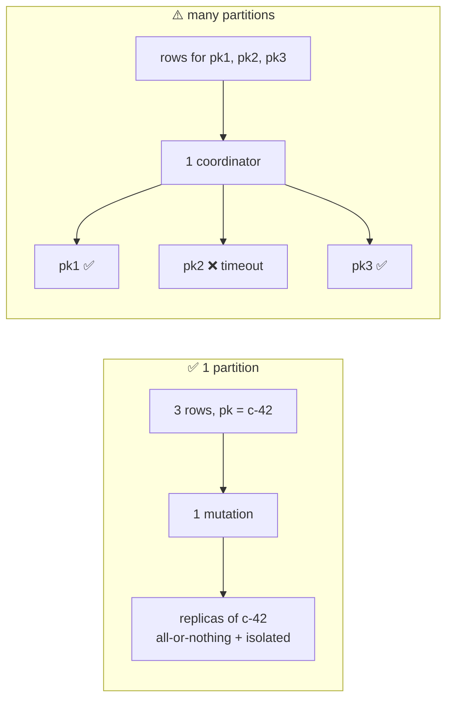

# Unlogged Batch

[⬅ Back to README](../../README.md)

## Problem Summary

No batchlog. **One partition** → one atomic, isolated mutation (the good case). **Many partitions** → no atomicity, and one coordinator does all the work → usually slower than separate async writes.

## Mermaid Diagram



## Concrete Example

```sql
-- ✅ 3 messages into the SAME partition: 1 mutation, 1 round trip
BEGIN UNLOGGED BATCH
  INSERT INTO chat.messages_by_conversation (conversation_id, bucket, message_id, body) VALUES (c42, 202609, now(), 'a');
  INSERT INTO chat.messages_by_conversation (conversation_id, bucket, message_id, body) VALUES (c42, 202609, now(), 'b');
  INSERT INTO chat.messages_by_conversation (conversation_id, bucket, message_id, body) VALUES (c42, 202609, now(), 'c');
APPLY BATCH;
```

```csharp
var batch = new BatchStatement().SetBatchType(BatchType.Unlogged);
foreach (var m in messages)                         // all same (conversation_id, bucket)
    batch.Add(insert.Bind(convId, bucket, TimeUuid.NewId(), m.Body));
await session.ExecuteAsync(batch.SetIdempotence(true));
```

| 3 rows | Round trips | Atomic | Partial failure possible |
|---|---:|:---:|:---:|
| 3 separate inserts, same partition | 3 | ❌ | ✅ |
| **unlogged batch, same partition** | 1 | ✅ | ❌ |
| unlogged batch, 3 partitions | 1 (+ fan-out on coordinator) | ❌ | ✅ |

- Single-partition batches skip the batchlog even when declared LOGGED → same cost.
- Across > 10 partitions → WARN (`unlogged_batch_across_partitions_warn_threshold`).

## Reference

- [CQL DML: BATCH](https://cassandra.apache.org/doc/latest/cassandra/developing/cql/dml.html)

---

[⬅ Back to README](../../README.md)
