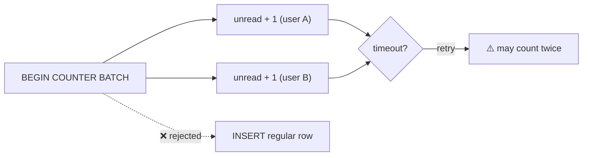

# Counter Batch

[⬅ Back to README](../../README.md)

## Problem Summary

Counter updates can only be batched with other counter updates, using `BEGIN COUNTER BATCH`. No batchlog, and a counter increment is **not idempotent** — never retry blindly.

## Mermaid Diagram



## Concrete Example

```sql
-- ✅ counters only
BEGIN COUNTER BATCH
  UPDATE chat.unread_by_user SET unread = unread + 1 WHERE user_id = ? AND conversation_id = ?;
  UPDATE chat.unread_by_user SET unread = unread + 1 WHERE user_id = ? AND conversation_id = ?;
APPLY BATCH;

-- ❌ InvalidRequest: "Counter and non-counter mutations cannot exist in the same batch"
BEGIN BATCH
  INSERT INTO chat.messages_by_conversation (...) VALUES (...);
  UPDATE chat.unread_by_user SET unread = unread + 1 WHERE ...;
APPLY BATCH;
```

```csharp
var batch = new BatchStatement().SetBatchType(BatchType.Counter)
    .Add(incrementUnread.Bind(userA, conv))
    .Add(incrementUnread.Bind(userB, conv));
await session.ExecuteAsync(batch);   // idempotence = false (default) → driver won't retry
```

| After a timeout | Value may be |
|---|---|
| no retry | +0 or +1 |
| retry | +1 or **+2** ❌ |

→ Real use: [ChatRepository.SendAsync](../../samples/CassandraDemo/ChatRepository.cs) sends the counter outside the logged batch.

## Reference

- [CQL DML: BATCH](https://cassandra.apache.org/doc/latest/cassandra/developing/cql/dml.html)
- [CQL Types: counter](https://cassandra.apache.org/doc/latest/cassandra/developing/cql/types.html)

---

[⬅ Back to README](../../README.md)
