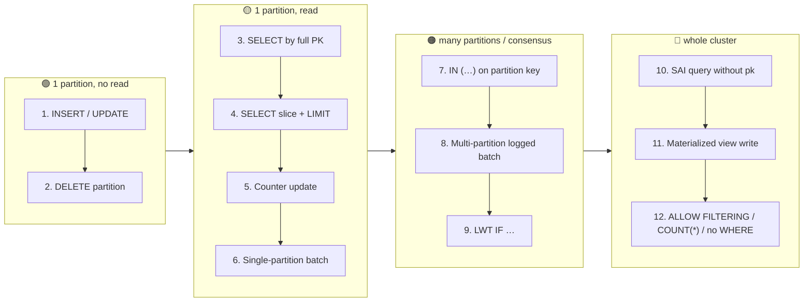

# Operations Ranked by Cost (Cheapest → Most Expensive)

[⬅ Back to README](../../README.md)

## Problem Summary

Cost is driven by **how many nodes** a query touches and whether it needs a **read before write**. Queries that hit one partition are cheap; anything that fans out across the cluster is expensive.

## Mermaid Diagram



## Concrete Example

RF = 3, 12-node cluster, `LOCAL_QUORUM`. Relative cost: 1× = one INSERT (indicative, not a benchmark).

| # | Operation | Nodes touched | Read before write? | Relative cost |
|---:|---|---:|:---:|---:|
| 1 | `INSERT` / `UPDATE` by full PK | 3 | ❌ | **1×** |
| 2 | `DELETE` whole partition | 3 | ❌ | 1× (+ tombstone on reads) |
| 3 | `SELECT` by full primary key | 2 | — | 1–2× |
| 4 | `SELECT` clustering slice `LIMIT 100` | 2 | — | 2–3× |
| 5 | Counter `UPDATE c = c + 1` | 3 | ✅ internal | 2–3× |
| 6 | Single-partition `BATCH` | 3 | ❌ | ~1× per batch |
| 7 | `WHERE pk IN (… 50 keys …)` | up to 12 | — | ~50× on one coordinator |
| 8 | Multi-partition `LOGGED BATCH` | 3 × N + batchlog | ❌ | N× + 2 extra writes |
| 9 | `INSERT … IF NOT EXISTS` (LWT) | 3, 4 round trips | ✅ | **4–5×** |
| 10 | SAI query without partition key | all 12 | — | 10–100× |
| 11 | Write to a table with a materialized view | 3 + view replicas | ✅ | 3–5× |
| 12 | `ALLOW FILTERING` / `SELECT COUNT(*)` / no `WHERE` | all 12, full scan | — | **∞ (grows with data)** |

```sql
-- #3  ✅ one partition, one row
SELECT * FROM shop.orders_by_customer WHERE customer_id = ? AND order_id = ?;

-- #12 ❌ scans every SSTable on every node
SELECT * FROM shop.orders_by_customer WHERE total > 100 ALLOW FILTERING;
```

## Reference

- [CQL DML: SELECT](https://cassandra.apache.org/doc/latest/cassandra/developing/cql/dml.html)
- [SAI Overview](https://cassandra.apache.org/doc/latest/cassandra/developing/cql/indexing/sai/sai-overview.html)

---

[⬅ Back to README](../../README.md)
