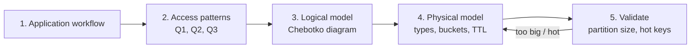

# Query-First Modeling

[⬅ Back to README](../../README.md)

## Problem Summary

RDBMS: model entities, then write queries. Cassandra: **list the queries first, then create one table per query**. Denormalization and duplication are expected.

## Mermaid Diagram

## Concrete Example

| Query | Table | Partition key | Clustering |
|---|---|---|---|
| Q1: orders of a customer, newest first | `orders_by_customer` | `customer_id` | `order_date DESC, order_id` |
| Q2: order details by id | `orders_by_id` | `order_id` | — |
| Q3: orders per day for ops | `orders_by_day` | `(day, bucket)` | `order_time DESC` |

Same order written to **3 tables** = 3× storage, but every read is a single-partition lookup.

## Reference

- [Data Modeling: Queries](https://cassandra.apache.org/doc/latest/cassandra/developing/data-modeling/data-modeling_queries.html)
- [Data Modeling: Logical](https://cassandra.apache.org/doc/latest/cassandra/developing/data-modeling/data-modeling_logical.html)

---

[⬅ Back to README](../../README.md)
