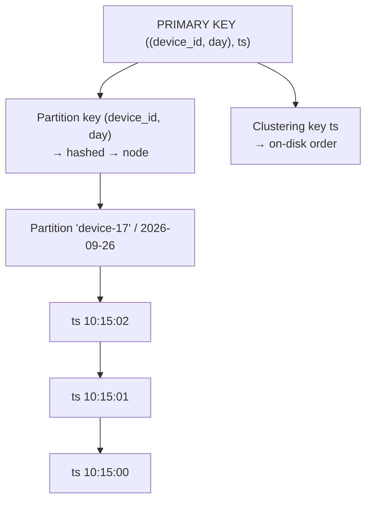

# Primary Key: Partition Key vs Clustering Key

[⬅ Back to README](../../README.md)

## Problem Summary

`PRIMARY KEY ((partition key), clustering keys)`. Partition key → **which node**. Clustering keys → **sort order inside the partition**. Queries must give the full partition key and filter clustering keys left-to-right.

## Mermaid Diagram



## Concrete Example

```sql
CREATE TABLE iot.readings_by_device_day (
  device_id   text,
  day         date,
  ts          timestamp,
  temperature double,
  PRIMARY KEY ((device_id, day), ts)
) WITH CLUSTERING ORDER BY (ts DESC);
```

| Query | Valid? | Why |
|---|:---:|---|
| `WHERE device_id=? AND day=?` | ✅ | full partition key |
| `WHERE device_id=? AND day=? AND ts > ?` | ✅ | range on clustering |
| `WHERE device_id=?` | ❌ | partial partition key |
| `WHERE ts > ?` | ❌ | no partition key |
| `WHERE device_id=? AND day=? ORDER BY ts ASC` | ✅ | reverse of clustering order |

## Reference

- [CQL DDL: Primary key](https://cassandra.apache.org/doc/latest/cassandra/developing/cql/ddl.html)

---

[⬅ Back to README](../../README.md)
