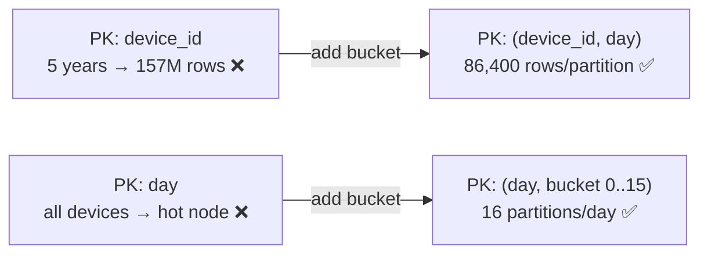

# Partition Sizing & Bucketing

[⬅ Back to README](../../README.md)

## Problem Summary

Keep partitions **< 100 MB and < 100,000 rows**. Unbounded keys (e.g. `device_id` alone for years of data) grow forever → add a time **bucket** to the partition key.

## Mermaid Diagram

## Concrete Example

Number of values in a partition:

`Nv = Nr × (Nc − Npk − Ns) + Ns`

| Symbol | Meaning | IoT example |
|---|---|---:|
| Nr | rows | 86,400 (1 reading/s for 1 day) |
| Nc | columns | 4 |
| Npk | primary key columns | 3 |
| Ns | static columns | 0 |
| **Nv** | values | **86,400** |

Size ≈ `Nr × row_size` = 86,400 × ~40 B ≈ **3.5 MB/partition/day** ✅

| Bucket | Rows / partition | Size | Verdict |
|---|---:|---:|---|
| none (`device_id`) | 31.5M / year | ~1.26 GB / year | ❌ |
| month | 2.6M | ~105 MB | ⚠️ |
| **day** | 86,400 | ~3.5 MB | ✅ |
| hour | 3,600 | ~144 KB | ✅ but 24 queries per day view |

## Reference

- [Data Modeling: Refining](https://cassandra.apache.org/doc/latest/cassandra/developing/data-modeling/data-modeling_refining.html)

---

[⬅ Back to README](../../README.md)
