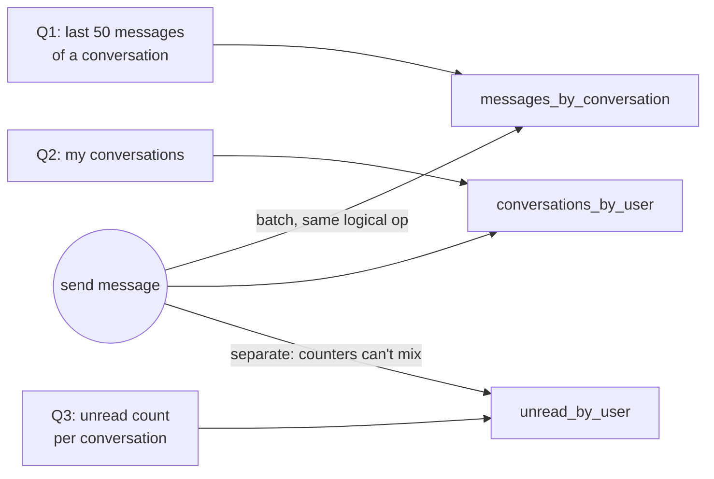
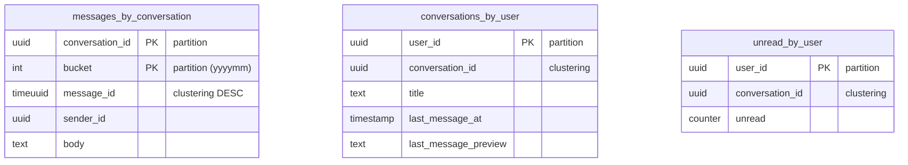

# Example 1 — Chat App

[⬅ Back to README](../../README.md)

## Problem Summary

Messaging app, 50M messages/day. Three access patterns → three tables, each answered by **one partition read**.

## Mermaid Diagram





## Concrete Example

```sql
CREATE TABLE chat.messages_by_conversation (
  conversation_id uuid, bucket int, message_id timeuuid,
  sender_id uuid, body text,
  PRIMARY KEY ((conversation_id, bucket), message_id)
) WITH CLUSTERING ORDER BY (message_id DESC);

CREATE TABLE chat.conversations_by_user (
  user_id uuid, conversation_id uuid,
  title text, last_message_at timestamp, last_message_preview text,
  PRIMARY KEY (user_id, conversation_id)
);

CREATE TABLE chat.unread_by_user (
  user_id uuid, conversation_id uuid, unread counter,
  PRIMARY KEY (user_id, conversation_id)
);

-- Q1
SELECT * FROM chat.messages_by_conversation
WHERE conversation_id = ? AND bucket = 202609 LIMIT 50;
```

| Design decision | Reason |
|---|---|
| `bucket = yyyymm` | busy group: 1,000 msg/day × 30 × 300 B ≈ **9 MB/partition** |
| `timeuuid` clustering | unique + time-sorted, no collisions at the same ms |
| `conversations_by_user` sorted client-side by `last_message_at` | a user has < ~1,000 conversations; avoids delete+insert on every message |
| counters in their own table | Cassandra rule: counter tables contain only counters + PK |

## Reference

- [Data Modeling](https://cassandra.apache.org/doc/latest/cassandra/developing/data-modeling/index.html)
- [CQL Types: counter, timeuuid](https://cassandra.apache.org/doc/latest/cassandra/developing/cql/types.html)

---

[⬅ Back to README](../../README.md)
