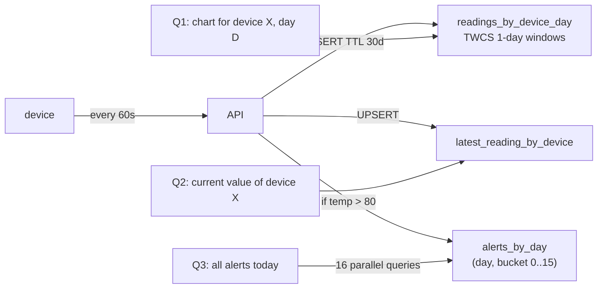
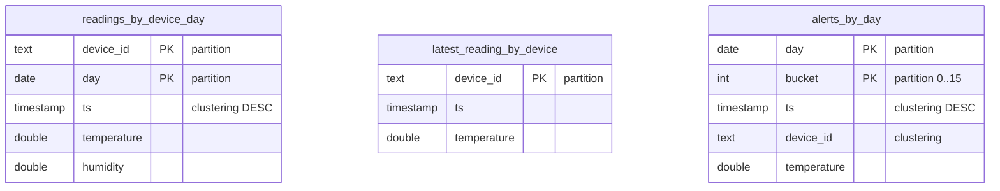

# Example 2 — IoT Telemetry

[⬅ Back to README](../../README.md)

## Problem Summary

1M devices, 1 reading/min (≈ 16,700 writes/s), keep 30 days. Time-series + TTL + TWCS; a separate "latest" table for dashboards; bucketed alerts to avoid a hot partition.

## Mermaid Diagram





## Concrete Example

```sql
CREATE TABLE iot.readings_by_device_day (
  device_id text, day date, ts timestamp,
  temperature double, humidity double,
  PRIMARY KEY ((device_id, day), ts)
) WITH CLUSTERING ORDER BY (ts DESC)
  AND default_time_to_live = 2592000
  AND compaction = {'class': 'TimeWindowCompactionStrategy',
                    'compaction_window_unit': 'DAYS', 'compaction_window_size': 1};

CREATE TABLE iot.alerts_by_day (
  day date, bucket int, ts timestamp, device_id text, temperature double,
  PRIMARY KEY ((day, bucket), ts, device_id)
) WITH CLUSTERING ORDER BY (ts DESC, device_id ASC);
```

| Metric | Value |
|---|---:|
| Rows / partition / day | 1,440 |
| Partition size | 1,440 × ~50 B ≈ **72 KB** ✅ |
| Rows / day total | 1.44 B |
| Raw data / day (RF=1) | ≈ 72 GB → ×3 RF ≈ 216 GB |
| Retention cost | TTL + TWCS → expired 1-day SSTables dropped whole, no tombstone scans |
| Alert bucket | `abs(hash(device_id)) % 16` → spreads 1 hot day over 16 partitions |

## Reference

- [TWCS](https://cassandra.apache.org/doc/latest/cassandra/managing/operating/compaction/twcs.html)
- [Data Modeling: Refining](https://cassandra.apache.org/doc/latest/cassandra/developing/data-modeling/data-modeling_refining.html)

---

[⬅ Back to README](../../README.md)
