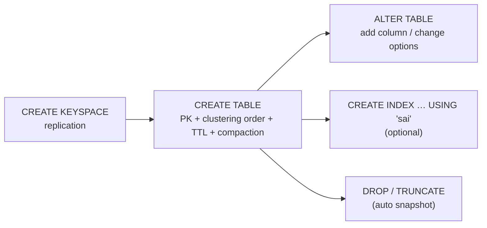

# CQL — DDL (Keyspace, Table, Index)

[⬅ Back to README](../../README.md)

## Problem Summary

DDL defines replication (keyspace), primary key + storage options (table), and optional SAI indexes. Schema changes are propagated cluster-wide; avoid running them concurrently from app code.

## Mermaid Diagram



## Concrete Example

```sql
CREATE KEYSPACE IF NOT EXISTS iot
  WITH replication = {'class': 'NetworkTopologyStrategy', 'dc1': 3};

CREATE TABLE IF NOT EXISTS iot.readings_by_device_day (
  device_id text, day date, ts timestamp,
  temperature double, humidity double,
  PRIMARY KEY ((device_id, day), ts)
) WITH CLUSTERING ORDER BY (ts DESC)
  AND default_time_to_live = 2592000
  AND compaction = {'class': 'TimeWindowCompactionStrategy',
                    'compaction_window_unit': 'DAYS', 'compaction_window_size': 1};

ALTER TABLE iot.readings_by_device_day ADD battery int;       -- ✅ cheap, metadata only
-- ALTER ... PRIMARY KEY                                       -- ❌ impossible: new table + migrate

CREATE INDEX IF NOT EXISTS readings_temp_sai
  ON iot.readings_by_device_day (temperature) USING 'sai';

DESCRIBE TABLE iot.readings_by_device_day;
```

| Type | Use |
|---|---|
| `uuid` / `timeuuid` | ids / time-ordered unique ids |
| `timestamp` / `date` | ms precision / day bucket |
| `text`, `int`, `bigint`, `double`, `decimal`, `boolean` | scalars |
| `set<>` / `list<>` / `map<>` | small collections (< ~100 items) |
| `counter` | increments; own table only |
| `frozen<udt>` | nested object stored as one blob |

Full script: [cql/schema.cql](../../cql/schema.cql)

## Reference

- [CQL DDL](https://cassandra.apache.org/doc/latest/cassandra/developing/cql/ddl.html)
- [CQL Types](https://cassandra.apache.org/doc/latest/cassandra/developing/cql/types.html)

---

[⬅ Back to README](../../README.md)
