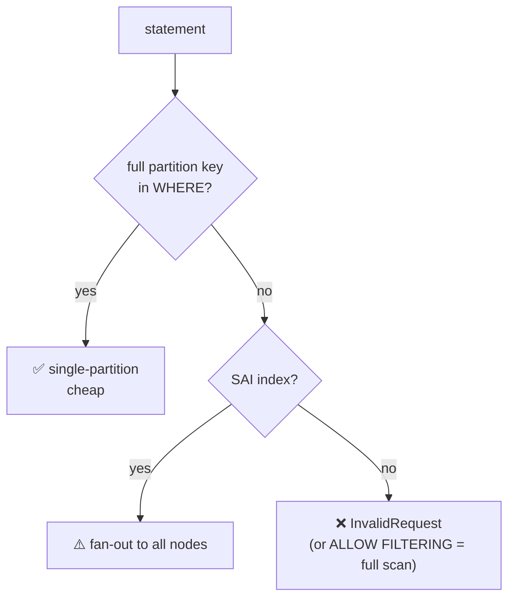

# CQL — DML (INSERT, UPDATE, SELECT, DELETE)

[⬅ Back to README](../../README.md)

## Problem Summary

Every DML statement must target **a partition** (full partition key in `WHERE`). `INSERT` and `UPDATE` are both upserts. `SELECT` filters clustering columns left-to-right only.

## Mermaid Diagram



## Concrete Example

```sql
-- INSERT (upsert) with TTL and explicit timestamp
INSERT INTO iot.latest_reading_by_device (device_id, ts, temperature)
VALUES ('device-17', '2026-09-26 10:15:00+0000', 21.4)
USING TTL 86400;

-- UPDATE = upsert too (creates the row if missing)
UPDATE iot.latest_reading_by_device SET temperature = 22.0 WHERE device_id = 'device-17';

-- SELECT: partition + clustering range + limit
SELECT ts, temperature FROM iot.readings_by_device_day
WHERE device_id = 'device-17' AND day = '2026-09-26'
  AND ts >= '2026-09-26 10:00:00+0000'
LIMIT 100;

-- DELETE: one column, one row, a range, or whole partition
DELETE humidity FROM iot.readings_by_device_day WHERE device_id = 'device-17' AND day = '2026-09-26' AND ts = '2026-09-26 10:15:00+0000';
DELETE FROM iot.readings_by_device_day WHERE device_id = 'device-17' AND day = '2026-09-26';

-- Counter
UPDATE chat.unread_by_user SET unread = unread + 1 WHERE user_id = ? AND conversation_id = ?;

-- LWT
INSERT INTO chat.users_by_email (email, user_id) VALUES (?, ?) IF NOT EXISTS;
```

More runnable queries: [cql/queries.cql](../../cql/queries.cql)

## Reference

- [CQL DML](https://cassandra.apache.org/doc/latest/cassandra/developing/cql/dml.html)

---

[⬅ Back to README](../../README.md)
