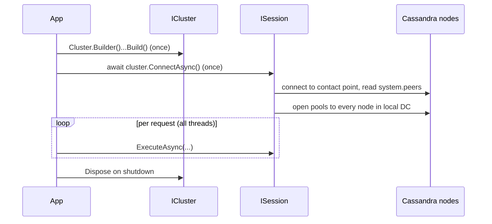
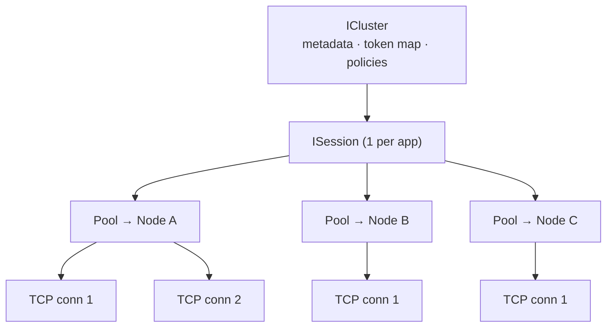

# .NET — Connect (Cluster & Session)

[⬅ Back to README](../../README.md)

## Problem Summary

`ICluster` and `ISession` are **thread-safe and expensive** (connection pools, topology metadata). Create **one of each per application** and register as singletons.

## Mermaid Diagram



## Concrete Example

```bash
dotnet add package CassandraCSharpDriver --version 3.23.0
```

```csharp
// samples/CassandraDemo/CassandraConnection.cs
public static ICluster BuildCluster(string contactPoint = "127.0.0.1", string localDc = "dc1") =>
    Cluster.Builder()
        .AddContactPoint(contactPoint)
        .WithPort(9042)
        .WithLoadBalancingPolicy(new DefaultLoadBalancingPolicy(localDc)) // token + DC aware
        .WithQueryOptions(new QueryOptions()
            .SetConsistencyLevel(ConsistencyLevel.LocalQuorum)
            .SetSerialConsistencyLevel(ConsistencyLevel.LocalSerial)
            .SetPageSize(500))
        .WithSpeculativeExecutionPolicy(new ConstantSpeculativeExecutionPolicy(50, 1))
        .WithSocketOptions(new SocketOptions().SetReadTimeoutMillis(12_000))
        .Build();
```

```csharp
// ASP.NET Core registration
builder.Services.AddSingleton(_ => CassandraConnection.BuildCluster("10.0.0.1", "dc1"));
builder.Services.AddSingleton(sp => sp.GetRequiredService<ICluster>().Connect());
```

| ❌ | ✅ |
|---|---|
| `new Cluster` per HTTP request → ~100 ms + new pools each time | 1 singleton, reused |

## Session ≠ Connection

`ISession` is **not** one connection. It owns one connection pool per node, and each connection multiplexes thousands of concurrent requests (stream IDs, up to 32 768 per connection on protocol v3+).



| Object | Count | Role |
|---|---|---|
| `ICluster` | 1 | knows nodes, token ranges, policies |
| `ISession` | 1 | routes each query, retries, caches prepared statements |
| Pool | 1 per node | a few TCP connections |
| TCP connection | a few per node | many in-flight requests (streams) |

One `ExecuteAsync` call:
1. Token of the partition key → replica (e.g. Node B).
2. Least-busy connection in Node B's pool.
3. Free stream ID → send → response. The connection stays open for the next request.

```csharp
// Pool size is tunable; the defaults are fine for most apps.
Cluster.Builder()
    .WithPoolingOptions(new PoolingOptions()
        .SetCoreConnectionsPerHost(HostDistance.Local, 2)
        .SetMaxConnectionsPerHost(HostDistance.Local, 4)
        .SetMaxRequestsPerConnection(2048))
```

| ADO.NET / EF | Cassandra driver |
|---|---|
| `SqlConnection` | one TCP connection (hidden) |
| hidden connection pool | `ISession` |
| `DbContext` (scoped, per request) | no equivalent — nothing per request |

## Reference

- [DataStax C# Driver](https://docs.datastax.com/en/developer/csharp-driver/latest/)

---

[⬅ Back to README](../../README.md)
