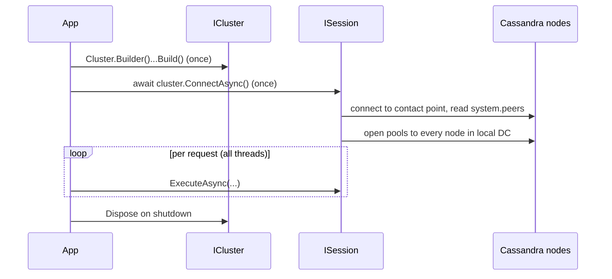

# .NET — Connect (Cluster & Session)

[⬅ Back to README](../../README.md)

## Problem Summary

`ICluster` and `ISession` are **thread-safe and expensive** (connection pools, topology metadata). Create **one of each per application** and register as singletons.

## Mermaid Diagram



## Concrete Example

```bash
dotnet add package CassandraCSharpDriver --version 3.23.0
```

```csharp
// samples/CassandraDemo/CassandraConnection.cs
public static ICluster BuildCluster(string contactPoint = "127.0.0.1", string localDc = "dc1") =>
    Cluster.Builder()
        .AddContactPoint(contactPoint)
        .WithPort(9042)
        .WithLoadBalancingPolicy(new DefaultLoadBalancingPolicy(localDc)) // token + DC aware
        .WithQueryOptions(new QueryOptions()
            .SetConsistencyLevel(ConsistencyLevel.LocalQuorum)
            .SetSerialConsistencyLevel(ConsistencyLevel.LocalSerial)
            .SetPageSize(500))
        .WithSpeculativeExecutionPolicy(new ConstantSpeculativeExecutionPolicy(50, 1))
        .WithSocketOptions(new SocketOptions().SetReadTimeoutMillis(12_000))
        .Build();
```

```csharp
// ASP.NET Core registration
builder.Services.AddSingleton(_ => CassandraConnection.BuildCluster("10.0.0.1", "dc1"));
builder.Services.AddSingleton(sp => sp.GetRequiredService<ICluster>().Connect());
```

| ❌ | ✅ |
|---|---|
| `new Cluster` per HTTP request → ~100 ms + new pools each time | 1 singleton, reused |

## Reference

- [DataStax C# Driver](https://docs.datastax.com/en/developer/csharp-driver/latest/)

---

[⬅ Back to README](../../README.md)
