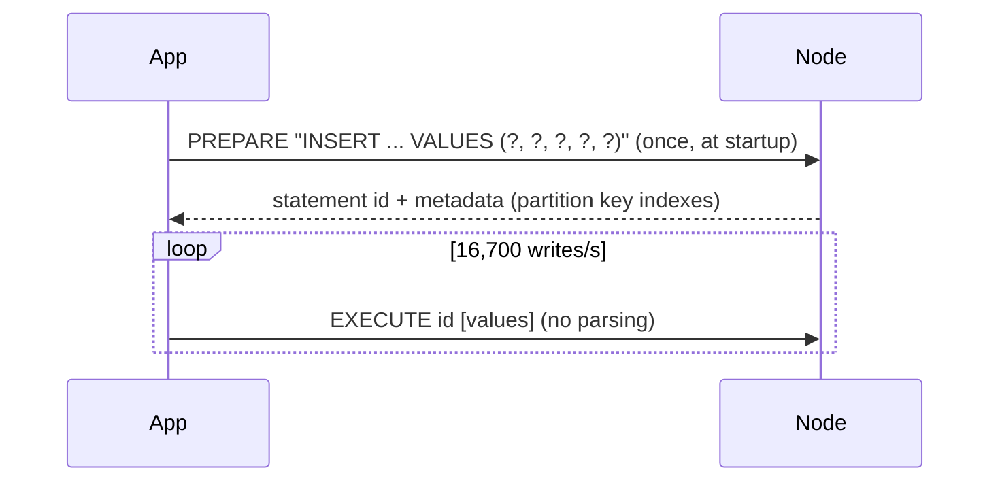

# .NET — Prepared Statements

[⬅ Back to README](../../README.md)

## Problem Summary

`PrepareAsync` parses the CQL once on the server; later executions send only the statement id + bound values. Faster, safe against CQL injection, and gives the driver the routing key for token-aware routing.

## Mermaid Diagram



## Concrete Example

```csharp
// samples/CassandraDemo/IotRepository.cs — prepared once in CreateAsync
_insertReading = await session.PrepareAsync(
    "INSERT INTO iot.readings_by_device_day (device_id, day, ts, temperature, humidity) VALUES (?, ?, ?, ?, ?)");

// per request
object humidityValue = humidity.HasValue ? humidity.Value : Unset.Value;   // Unset → no tombstone
await session.ExecuteAsync(
    _insertReading.Bind(deviceId, day, ts, temperature, humidityValue)
                  .SetIdempotence(true));                                   // safe to retry / speculate
```

| Approach | Server parse | Token-aware | Injection-safe |
|---|:---:|:---:|:---:|
| `SimpleStatement($"... '{id}'")` | every call | ❌ | ❌ |
| `SimpleStatement("... ?", id)` | every call | ⚠️ | ✅ |
| **`PreparedStatement.Bind(id)`** | once | ✅ | ✅ |

## Reference

- [C# driver: Parameterized queries](https://docs.datastax.com/en/developer/csharp-driver/latest/features/parametrized-queries/index.html)

---

[⬅ Back to README](../../README.md)
