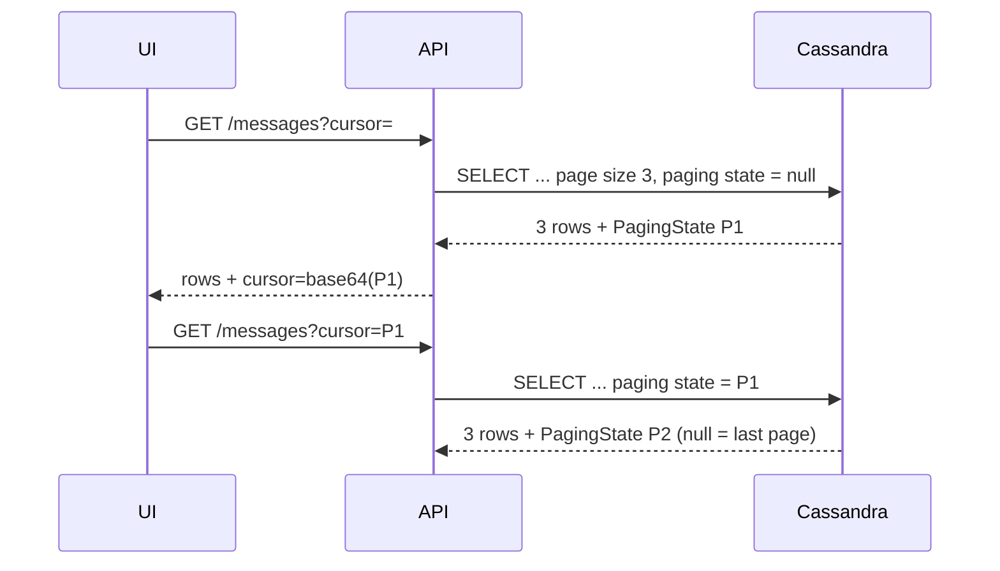

# .NET — Paging

[⬅ Back to README](../../README.md)

## Problem Summary

Never load a large partition at once. Use **manual paging** with an opaque `PagingState` token returned to the client (e.g. as a cursor in an API) — no `OFFSET` in Cassandra.

## Mermaid Diagram



## Concrete Example

```csharp
// samples/CassandraDemo/ChatRepository.cs
var statement = _selectMessages.Bind(conversationId, bucket)
    .SetPageSize(pageSize)
    .SetAutoPage(false)            // one page per call
    .SetPagingState(pagingState)   // null for the first page
    .SetIdempotence(true);

var rs = await _session.ExecuteAsync(statement);
var messages = rs.Select(ToMessage).ToList();
return new MessagePage(messages, rs.PagingState);  // PagingState == null → no more pages
```

```text
page 1: message #7, message #6, message #5
page 2: message #4, message #3, message #2
page 3: message #1
```

| Style | Memory | Use |
|---|---|---|
| Auto-paging (`foreach` over `RowSet`) | streams, fetches pages sync | batch jobs |
| **Manual paging (`SetAutoPage(false)`)** | 1 page | APIs / UIs |

## Reference

- [C# driver: Paging](https://docs.datastax.com/en/developer/csharp-driver/latest/features/paging/index.html)

---

[⬅ Back to README](../../README.md)
