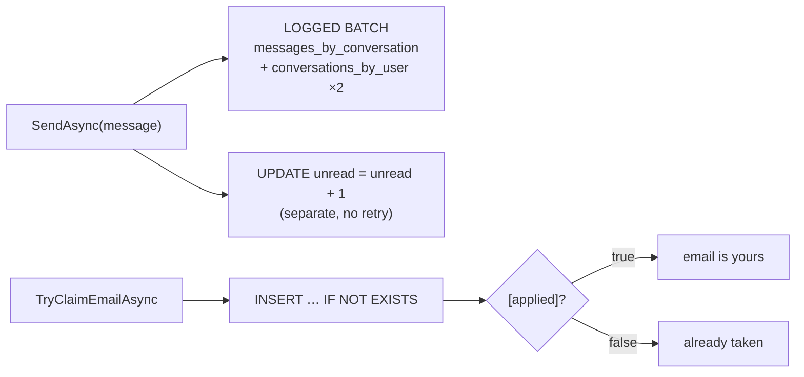

# .NET — Batch, Counter & LWT

[⬅ Back to README](../../README.md)

## Problem Summary

Batch = atomic write to denormalized tables. Counters must be executed separately (and are not idempotent). LWT returns an `[applied]` column you must check.

## Mermaid Diagram



## Concrete Example

```csharp
// samples/CassandraDemo/ChatRepository.cs
var messageId = TimeUuid.NewId();
var sentAt = messageId.GetDate();

var batch = new BatchStatement()
    .Add(_insertMessage.Bind(conversationId, BucketOf(sentAt), messageId, senderId, body))
    .Add(_updateConversation.Bind(sentAt, preview, senderId, conversationId))
    .Add(_updateConversation.Bind(sentAt, preview, recipientId, conversationId));
await _session.ExecuteAsync(batch);

await _session.ExecuteAsync(_incrementUnread.Bind(recipientId, conversationId));
```

```csharp
// LWT
var rs = await _session.ExecuteAsync(_claimEmail.Bind(email, userId));
bool applied = rs.First().GetValue<bool>("[applied]");
```

```text
claim email (sara): True
claim email (omar): False
```

| Statement | Idempotent? | Retry safely? |
|---|:---:|:---:|
| `INSERT` / `UPDATE SET x = ?` | ✅ | ✅ |
| `UPDATE SET c = c + 1` (counter) | ❌ | ❌ |
| `UPDATE SET l = l + [x]` (list append) | ❌ | ❌ |
| `INSERT … IF NOT EXISTS` | ⚠️ | check `[applied]` + re-read |

## Reference

- [CQL DML: BATCH](https://cassandra.apache.org/doc/latest/cassandra/developing/cql/dml.html)
- [C# driver](https://docs.datastax.com/en/developer/csharp-driver/latest/)

---

[⬅ Back to README](../../README.md)
