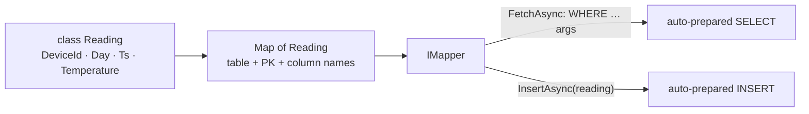

# .NET — Mapper (Object ↔ Row)

[⬅ Back to README](../../README.md)

## Problem Summary

`Cassandra.Mapping.Mapper` maps POCOs to tables (like a micro-ORM). It still generates **prepared statements** and still requires the partition key in `WHERE` — it does not hide the data model.

## Mermaid Diagram



## Concrete Example

```csharp
// samples/CassandraDemo/IotRepository.cs
MappingConfiguration.Global.Define(
    new Map<Reading>()
        .KeyspaceName("iot")
        .TableName("readings_by_device_day")
        .PartitionKey(r => r.DeviceId, r => r.Day)
        .ClusteringKey(r => r.Ts, SortOrder.Descending)
        .Column(r => r.DeviceId, c => c.WithName("device_id"))
        .Column(r => r.Day, c => c.WithName("day"))
        .Column(r => r.Ts, c => c.WithName("ts"))
        .Column(r => r.Temperature, c => c.WithName("temperature"))
        .Column(r => r.Humidity, c => c.WithName("humidity")));

IMapper mapper = new Mapper(session);

var rows = await mapper.FetchAsync<Reading>(
    "WHERE device_id = ? AND day = ? AND ts >= ? AND ts < ?", deviceId, day, from, to);
List<Reading> readings = rows.ToList();   // ⚠️ forward-only: a 2nd enumeration returns 0 rows
```

```csharp
// ❌ real bug found while building this sample
var readings = await mapper.FetchAsync<Reading>(...);
Console.WriteLine(readings.Count());   // 10 — consumes the RowSet
Console.WriteLine(readings.First());   // InvalidOperationException: Sequence contains no elements
```

| Option | Control | Boilerplate |
|---|---|---|
| Raw `PreparedStatement` | full (Unset, idempotence, CL per call) | more |
| **Mapper** | good (`CqlQueryOptions`) | less |
| LINQ `Table<T>` | limited | least |

## Reference

- [C# driver: Mapper](https://docs.datastax.com/en/developer/csharp-driver/latest/features/components/mapper/index.html)

---

[⬅ Back to README](../../README.md)
