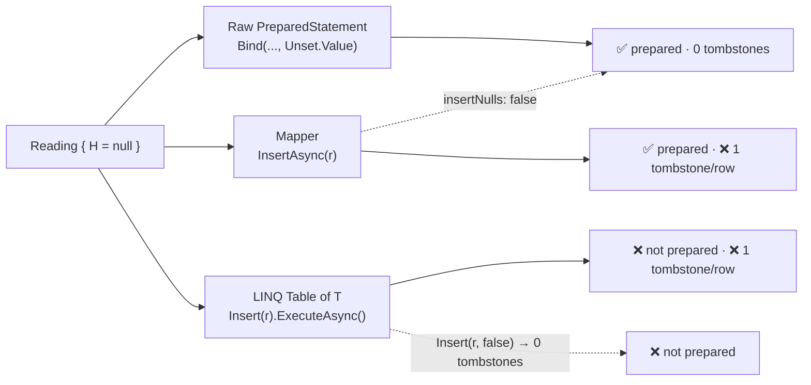

# .NET — Raw vs Mapper vs LINQ

[⬅ Back to README](../../README.md)

## Problem Summary

Three ways to query from C#. Same latency, but they differ in **prepared statements** and **tombstones from `null`** — measured below on Cassandra 5.0.

## Mermaid Diagram



## Concrete Example

Same insert + same single-partition read, three ways:

```csharp
// 1. Raw
await session.ExecuteAsync(insert.Bind(id, ts, t, h.HasValue ? h.Value : Unset.Value));
var rs = await session.ExecuteAsync(select.Bind(id, from));

// 2. Mapper (Cassandra.Mapping)
await mapper.InsertAsync(reading, insertNulls: false);           // default insertNulls = true ❌
var list = (await mapper.FetchAsync<Reading>("WHERE id = ? AND ts >= ?", id, from)).ToList();

// 3. LINQ (Cassandra.Data.Linq)
await table.Insert(reading, insertNulls: false).ExecuteAsync();    // default true ❌
var list2 = (await table.Where(r => r.Id == id && r.Ts >= from).ExecuteAsync()).ToList();
```

**Measured** — 2,000 ops each, single node in Docker, `H = null`:

| Approach | Insert µs/op | Read µs/op | Prepared on server | Tombstones / 100 rows |
|---|---:|---:|:---:|---:|
| Raw + `Unset.Value` | 2,803 | 2,771 | ✅ | **0** |
| Mapper (default) | 2,682 | 2,437 | ✅ | **100** ❌ |
| Mapper `insertNulls: false` | 2,316 | — | ✅ new statement per null combination | **0** |
| LINQ (default) | 2,397 | 2,555 | ❌ re-parsed every call | **100** ❌ |
| LINQ `Insert(r, false)` | — | — | ❌ | **0** |

Latency ≈ equal (network-bound) → choose by **correctness**, not speed.

| Capability | Raw | Mapper | LINQ |
|---|:---:|:---:|:---:|
| Skip nulls (no tombstone) | ✅ `Unset.Value` | ✅ `insertNulls: false` | ✅ `Insert(r, false)` |
| Per-query CL | ✅ `SetConsistencyLevel` | ✅ `CqlQueryOptions` | ✅ `SetConsistencyLevel` |
| Paging state | ✅ | ✅ `FetchPageAsync` | ✅ `ExecutePagedAsync` |
| LWT | ✅ `[applied]` | ✅ `InsertIfNotExistsAsync` → `AppliedInfo<T>` | ✅ `Insert(r).IfNotExists()` |
| Batch | ✅ `BatchStatement` | ✅ `mapper.CreateBatch()` | ✅ `session.CreateBatch().Append(...)` |
| Compile-time checked query | ❌ string | ❌ string | ✅ lambda |
| Boilerplate | high | medium | low |

## Pitfalls

- ❌ `Count()` then `First()` on `FetchAsync` result → 0 rows. ✅ `.ToList()` once (forward-only `RowSet`).
- ❌ Mapper `InsertAsync(r)` / LINQ `Insert(r)` with nullable fields → tombstone per null. ✅ pass `insertNulls: false`.
- ⚠️ `insertNulls: false` prepares one statement per null combination (5 nullable columns → up to 32).
- ❌ LINQ on hot paths → not prepared, re-parsed every call. ✅ Raw or Mapper.

Mapping config used here: [IotRepository.cs](../../samples/CassandraDemo/IotRepository.cs)

## Reference

- [C# driver: Mapper](https://docs.datastax.com/en/developer/csharp-driver/latest/features/components/mapper/index.html)
- [C# driver: LINQ](https://docs.datastax.com/en/developer/csharp-driver/latest/features/components/linq/index.html)

---

[⬅ Back to README](../../README.md)
