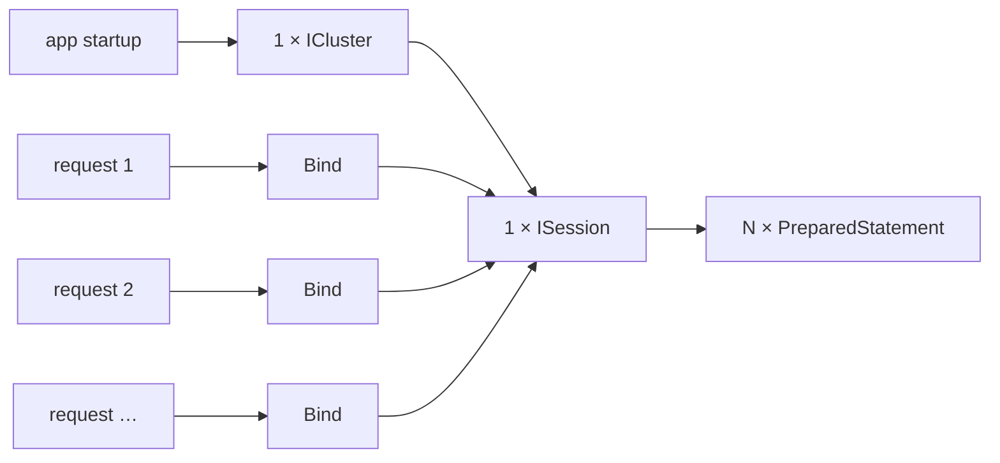

# BP 1 — One Session + Prepared Statements

[⬅ Back to README](../../README.md)

## Problem Summary

Create the session once, prepare each statement once, bind per request. Removes per-call connection setup and server-side parsing.

## Mermaid Diagram



## Concrete Example

```csharp
// ❌ per request: new pools + parse every time
using var cluster = Cluster.Builder().AddContactPoint("10.0.0.1").Build();
var session = cluster.Connect();
session.Execute($"SELECT * FROM iot.latest_reading_by_device WHERE device_id = '{id}'");

// ✅ singleton session + prepared once
private static readonly Task<PreparedStatement> Select =
    Session.PrepareAsync("SELECT * FROM iot.latest_reading_by_device WHERE device_id = ?");

var rs = await Session.ExecuteAsync((await Select).Bind(id).SetIdempotence(true));
```

| Metric (indicative) | ❌ | ✅ |
|---|---:|---:|
| Connection setup per request | ~50–100 ms | 0 |
| Server CQL parse | every call | once |
| Token-aware routing | ❌ | ✅ |

## Reference

- [C# driver: Parameterized queries](https://docs.datastax.com/en/developer/csharp-driver/latest/features/parametrized-queries/index.html)

---

[⬅ Back to README](../../README.md)
