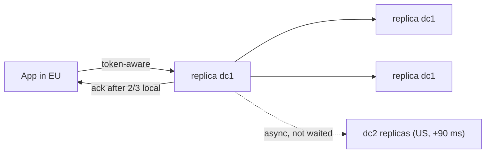

# BP 2 — LOCAL_QUORUM + Token/DC-Aware Routing

[⬅ Back to README](../../README.md)

## Problem Summary

`LOCAL_QUORUM` for reads and writes gives strong consistency inside a DC without waiting on cross-region latency. Token-aware routing sends requests straight to a replica.

## Mermaid Diagram



## Concrete Example

| CL (RF=3 per DC, 2 DCs) | Waits for | Latency EU app | Strong in DC? |
|---|---|---:|:---:|
| `ONE` | 1 any | ~1 ms | ❌ |
| **`LOCAL_QUORUM`** | 2 in dc1 | ~2 ms | ✅ |
| `QUORUM` | 4 of 6 total | ~90 ms | ✅ |
| `EACH_QUORUM` | 2 in each DC | ~90 ms | ✅ both |

```csharp
.WithLoadBalancingPolicy(new DefaultLoadBalancingPolicy("dc1"))
.WithQueryOptions(new QueryOptions()
    .SetConsistencyLevel(ConsistencyLevel.LocalQuorum)
    .SetSerialConsistencyLevel(ConsistencyLevel.LocalSerial))
```

## Reference

- [Dynamo: Tunable Consistency](https://cassandra.apache.org/doc/latest/cassandra/architecture/dynamo.html)

---

[⬅ Back to README](../../README.md)
